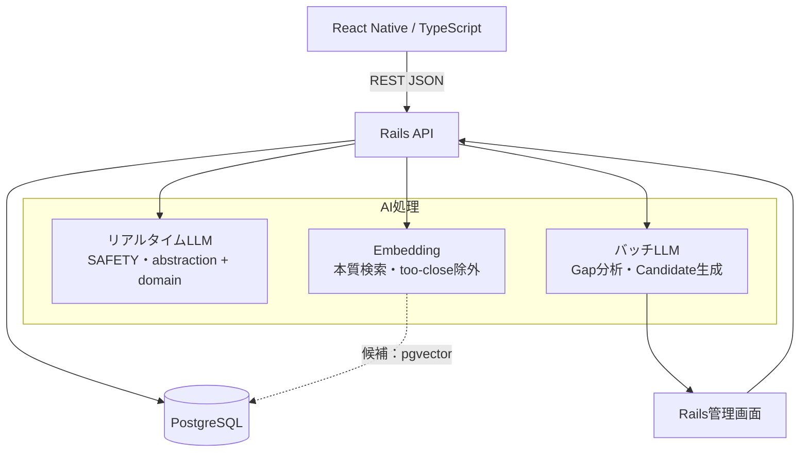
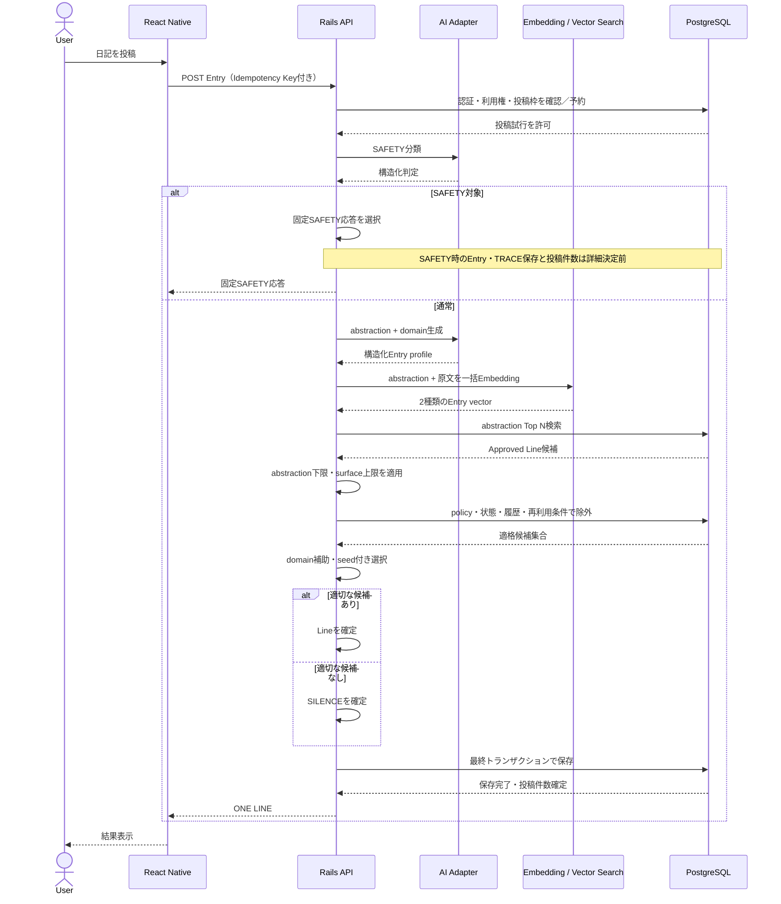
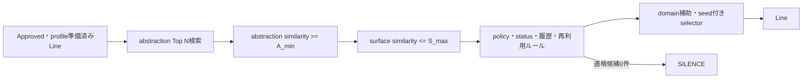
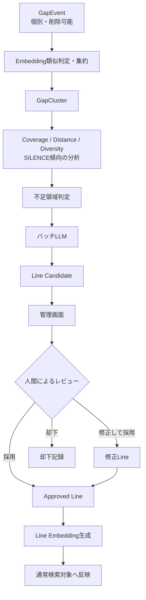

# obserbing AI基本設計

**文書ステータス：基本設計（Reflective Distance再評価・B-v2設計方針反映）**

**作成日：2026年8月12日（2026年8月13日更新）**

---

# 1. 目的

本書は、obserbingの要件をAI、Embedding、RailsおよびPostgreSQLによってどのように実現するかを定義する。

本書が扱うのは、AI処理の構成、責務分担、処理フロー、障害時の制御、運用、PoCおよびモデル選定方針である。プロダクトの人格、体験、禁止事項およびデータ保持要件そのものは再定義しない。

AIの目的は、ユーザーへ自由文章を生成することではなく、日記の意味を限定的に理解し、登録済みLineの中から適切な距離を持つ候補を見つけるための表現を作ることである。最終判断と状態変更はRailsが担う。

---

# 2. 上位ドキュメントとの関係

本書の上位仕様は次の2文書とする。

- [README](../README.md)：プロジェクト概要と技術構成の方針
- [要件定義書](要件定義_v1_0.md)：プロダクトが実現すること、守る要件および制約

要件と本書の役割は次のとおり分離する。

| 文書 | 主な責務 |
|---|---|
| README | プロジェクトと技術構成の概要 |
| 要件定義書 | What / Why、プロダクト要件、禁止事項、受入条件 |
| 本書 | How、AI処理方式、Railsとの責務分担、運用・PoC方針 |

次の事項は要件定義書を正とし、本書では実現方式だけを扱う。

- obserbingの人格、基本原則、最上位要件
- Lineの再利用およびMeaning Clusterの直近利用に関する条件
- obserbing distance、SAFETYおよびSILENCEのプロダクト上の意味と対象条件
- Gap、Coverage、Distance、Diversityおよび余白の要件
- Privacy by Design、削除、匿名集計の要件
- AI生成Lineに対するHuman in the Loop

上位文書と本書に矛盾がある場合は上位文書を優先し、本書を更新する。

---

# 3. AIアーキテクチャ概要

AI処理を、応答特性と責務が異なる次の3系統に分離する。

1. **リアルタイムLLM**：投稿リクエスト内でSAFETY判定とEntryのabstraction + domain生成を行う。B-v2ではLine候補を評価しない。
2. **Embedding**：abstractionで本質的に近い候補を検索し、Entry原文とLine本文のsurface similarityで近すぎる候補を除外する。Gap集約も補助する。
3. **バッチLLM**：Gap分析やLine Candidate生成など、ユーザーを待たせない処理を非同期に行う。

Railsは全処理のオーケストレーターであり、AIへの入力を組み立て、出力を検証し、禁止条件と状態遷移を適用して、結果を確定する。AI Providerへ直接接続するのはRails側のAdapterだけとし、React NativeからAI APIを呼び出さない。



PostgreSQL上のベクトル検索には`pgvector`を有力候補とするが、採用はPoCおよび詳細設計で確定する。バックグラウンドジョブの実行基盤もRailsのジョブ抽象を介し、具体製品は本書では決定しない。

---

# 4. AIとRailsの責務分担

## 4.1 基本原則

- **AI**：自然言語の意味理解、曖昧さを含む分類・評価、候補への相対的なスコア付けを担う。
- **Rails**：認証、利用権、明確な禁止条件、状態管理、入力・出力検証、永続化、最終決定を担う。

AI出力は事実や命令ではなく、検証が必要な評価値として扱う。AIにDB更新、公開状態の変更、利用権判定を直接行わせない。

## 4.2 責務一覧

| 処理 | AI | Rails | 理由 |
|---|---|---|---|
| 日記の意味理解 | abstraction + domain候補を抽出 | スキーマ・版を検証し、保存可否を判断 | 自然言語理解はAI向きだが、保存形式はシステム契約であるため |
| SAFETY | 構造化された判定候補を返す | 不正・判定不能を含めて分岐を確定 | 高リスク分岐を未検証の出力だけで確定しないため |
| Line候補の適格判定 | 事前生成した表現とEmbeddingを提供 | abstraction下限、surface上限、状態・履歴・policyを適用 | 投稿時のLine評価LLMを使わず、再現可能な帯域を作るため |
| 適格候補からの選択 | なし | 版・履歴・seedに基づいて最終候補を確定 | 最高得点1件を当てる方式にせず、監査可能にするため |
| 利用プラン・投稿上限 | なし | 判定・同時実行制御 | 明確な業務ルールであるため |
| Lineの状態 | なし | Candidate / Approved / Retiredを管理 | 公開状態は監査可能な状態遷移であるため |
| 再利用・直近利用制御 | なし | 要件定義書の条件を適用 | 正確な履歴照合が必要なため |
| SILENCE | 通常候補の不成立を示す評価材料 | SILENCEへの分岐と文言を確定 | SILENCEはシステム上の最終応答であるため |
| Entry / TRACE / Gap保存 | なし | トランザクションで保存 | 整合性と削除要件を保証するため |
| Candidate生成 | 候補本文と付随評価を生成 | Candidateとして保存し、公開しない | Human in the Loopを強制するため |
| 認証・課金・権限 | なし | 全て担当 | AIに権限判断を委ねないため |

---

# 5. リアルタイムLLM

## 5.1 責務

B-v2のリアルタイムLLMは、投稿リクエストの応答時間内で次を行う。

- SAFETY分類
- abstraction + domain生成

Line本文の自由生成、候補ごとの評価、obserbing distanceのリアルタイム採点は行わない。通常応答として返せるのは、Railsが許可したApproved LineのIDに限る。structureを分析用に生成・保存する余地は残すが、B-v2のリアルタイム選定条件には使用しない。

## 5.2 設計方針

- 処理種別ごとに入力・出力スキーマを分離する。
- 構造化出力を利用し、Railsで型、必須項目、列挙値、数値範囲、候補IDを検証する。
- プロンプト、スキーマ、評価ロジックにはそれぞれバージョンを持たせる。
- 温度等の生成パラメータは処理別設定とし、PoCで決定する。
- 同じ投稿の再送ではIdempotency Keyを用い、異なるLineを返したり二重保存したりしない。
- プロバイダーやモデルの選定は設定に閉じ込め、ドメイン処理から具体名を参照しない。

## 5.3 呼び出し回数のB-v2案

通常投稿では、再試行を除き次の最大3呼び出しを基本案とする。

1. SAFETY分類：1回
2. abstraction + domain生成：1回
3. Entry abstractionとEntry原文の一括Embedding：1回

SAFETY対象と確定した場合は1回で終了する。リアルタイムLine評価LLMは0回とし、Line側の表現・Embeddingは登録、承認またはバッチ時に事前生成する。

SAFETY分類とabstraction + domain生成は、失敗境界を分けるため別処理とする。投稿時に複数LLM Providerへfan-outせず、可能なら1 Provider + Embeddingで成立する構成を優先する。Provider、モデルおよび契約はPoC後まで未決定とする。

---

# 6. Embedding

## 6.1 用途

Embeddingは最終決定ではなく、「本質的に十分近く、表面的には近すぎない」候補帯域を作るために用いる。

- Entry / Approved Lineのabstractionのベクトル化
- Entry原文 / Approved Line本文のベクトル化
- abstraction類似度による候補検索と下限判定
- surface similarityによるtoo-close上限判定
- GapEventの類似判定とGapCluster形成の補助
- Meaning Cluster形成の補助

## 6.2 ベクトル化対象

主検索キーはEntry / Line双方のabstractionとし、abstraction similarityを適格条件の下限として扱う。別途Entry原文とLine本文もEmbeddingし、surface similarityをtoo-close除外の上限として用いる。surface similarityが低いほど良いとは扱わない。

Entry abstractionとEntry原文は同一Embeddingモデル・次元・正規化版で、可能なら1リクエストの配列入力として生成する。いずれも個別ユーザーデータとして削除対象に含める。

## 6.3 Line Embeddingのライフサイクル

- HumanまたはAI Candidateとして作成した時点では、通常検索へ公開しない。
- Approvedへの変更時、または検索対象フィールドの更新時にabstraction、domain、本文Embedding、abstraction Embeddingを事前生成する。
- 検索時はDB条件でも`Approved`だけに限定する。
- Retiredへ変更した時点で通常検索から除外する。過去TRACEが参照するLineは維持する。
- 各Embeddingには用途、モデル識別子、次元、ベクトル生成バージョンおよびLine本文hashを関連付ける。
- モデル変更時は再計算ジョブを実行し、新旧ベクトルの切り替えを完了するまで検索バージョンを混在させない。

## 6.4 検索基盤

PostgreSQLと`pgvector`によるabstraction近似近傍Top N検索を第一候補とする。取得候補だけsurface similarityを計算し、Railsルールへ渡す。全LineのRuby総当たりは本番設計にしない。データ量、検索精度、インデックス更新、運用負荷をPoCで確認し、必要な場合にのみ外部ベクトルDBを比較する。

---

# 7. バッチLLM

## 7.1 責務

バッチLLMはユーザーの同期応答から切り離し、次を行う。

- GapCluster単位の不足領域分析
- Coverage、Distance、Diversity、SILENCE傾向の解釈補助
- Lineライブラリの偏り分析
- 管理者レビュー用のLine Candidate生成

## 7.2 実行方針

- Railsのジョブとして冪等に実行できる単位へ分割する。
- 集約対象期間、GapCluster、使用モデル、プロンプトバージョンを実行記録へ残す。
- 同一対象・同一バージョンの重複実行を防止する。
- 個々の日記原文をバッチLLMへ渡さず、削除可能なEntry AI profileまたは十分に匿名化された集約情報を使用する。
- 生成物は必ずCandidateとして保存し、自動でApprovedへ遷移させない。

分析は「集約対象期間 × GapCluster」、Candidate生成は「GapCluster × 生成バージョン」を基本的な実行単位候補とする。バッチの頻度、対象件数、入力データの匿名化境界およびCandidate生成数は詳細設計で決定する。

---

# 8. 日記投稿時の処理フロー

## 8.1 シーケンス



## 8.2 処理別設計

| # | 処理 | 担当 | 主な入力 | 主な出力 | 実行 | 保存 | AI呼出し |
|---:|---|---|---|---|---|---|---:|
| 1 | 入力・認証検証 | Rails | Credential、日記、Idempotency Key | 正規化済み入力 | 同期 | なし | 0 |
| 2 | 投稿枠確認・予約 | Rails | Account、Plan、当日利用状況 | 投稿試行の許可 | 同期 | 本文を含まない予約メタデータ候補 | 0 |
| 3 | SAFETY分類 | リアルタイムLLM + Rails | 日記原文、分類スキーマ | normal / safety / indeterminate | 同期 | 最終確定までメモリ上 | 1 |
| 4 | Entry profile生成 | リアルタイムLLM + Rails | 日記原文、abstraction + domainスキーマ | 版付きEntry profile | 同期 | 最終確定までメモリ上 | 1 |
| 5 | 一括Embedding生成 | Embedding Adapter | abstraction、日記原文 | 用途別の2ベクトル | 同期 | 最終確定までメモリ上 | 1 |
| 6 | abstraction近傍検索 | Rails + pgvector候補 | abstraction vector、Approved・版条件 | Top N候補集合 | 同期 | なし | 0 |
| 7 | 適格帯域・禁止候補除外 | Rails | 候補、surface vector、policy、利用履歴、状態 | 適格候補集合 | 同期 | なし | 0 |
| 8 | 軽量選択 | Rails | 適格候補、domain、履歴、selector版、seed | Line候補または候補なし | 同期 | なし | 0 |
| 9 | Line / SILENCE確定 | Rails | 選択結果、設定 | 応答対象、Gap理由 | 同期 | なし | 0 |
| 10 | 保存・件数確定 | Rails | Entry、profile、Embedding、応答、分析情報 | TRACE等 | 同期 | 1トランザクション | 0 |
| 11 | Gap集約 | Rails Job | 保存済みGapEvent | GapCluster・集計 | 非同期 | 集約結果 | 別途 |

通常系の外部API呼び出しはB-v2案で最大3回、SAFETY系は1回である。リアルタイムLine評価LLMは0回とする。リトライは別カウントとし、コスト計測へ含める。

## 8.3 保存と投稿件数の整合性

外部AI APIの待機中にDBトランザクションを保持し続けない。並行投稿による上限超過を防ぐため、本文を含まない短命な「投稿枠予約」を概念として設ける案を採用する。

1. 短いトランザクションで投稿枠を確認し、Idempotency Keyに対する予約を作る。
2. AI処理はトランザクション外で行う。
3. 成功時に短い最終トランザクションでEntry、Entry AI profile、Embedding、TRACE、必要なGapEventを保存し、予約を投稿済み件数へ確定する。
4. 失敗時は予約を解放または期限切れにし、投稿済み件数を増やさない。

最終トランザクションが失敗した場合は全てをロールバックし、投稿済み件数を増やさない。保存完了後にクライアントとの通信だけが失敗した場合は、同じIdempotency Keyへの再送に保存済みの同一結果を返し、AI再実行と二重計上を防ぐ。

予約を専用テーブル、ロックまたは別方式のどれで実装するかはDB詳細設計へ送る。

---

# 9. Entry AI profile

## 9.1 役割

Entry AI profileは、日記原文を表示用に再表現するものではなく、検索と分析に必要な意味を限定的に表す中間データである。B-v2のリアルタイム選定ではabstractionとdomainだけを使用する。

| 概念 | 役割 |
|---|---|
| 日記原文 | ユーザーが書いた一次情報。TRACE表示の正本 |
| Entry AI profile | Entry単位のabstraction・domainと版情報。検索の中間表現 |
| Meaning Structure | 初回PoCで用いたthemes / structure / abstraction。履歴・分析用 |
| Theme | Line等へ付与する比較的粗い分類・編集メタデータ |
| Meaning Cluster | 類似するMeaning StructureやGapを束ねる集合 |

Entry AI profileとMeaning StructureはAI出力であっても個別ユーザーデータであり、匿名集計とは扱わない。Entryまたはアカウント削除時には、関連Embeddingおよび個別GapEventとともに削除する。

## 9.2 利用方法

- リアルタイム検索：abstractionを主検索キー、Entry原文をtoo-close除外キーとしてEmbeddingする。
- domain補助：候補分布とselectorの有限な補助情報にのみ用い、適格条件にはしない。
- structure：分析・デバッグ用に保持してもよいが、リアルタイムの適格条件、重み、tie-breakには用いない。
- Gap分析：個別GapEventの特徴量として利用し、その後GapClusterへ集約する。
- 監査・再現：スキーマ、プロンプト、モデルの各バージョンを関連付ける。

## 9.3 構造例

次は検討用の例であり、確定スキーマではない。

```json
{
  "schema_version": "b-v2-entry-profile-vX",
  "abstraction": "決定と喪失可能性の同居",
  "domain": {
    "primary": "decision",
    "secondary": ["expectation"],
    "taxonomy_version": "domain-vX",
    "confidence": 0.0
  }
}
```

診断、感情の断定、人物像の固定化、不要な固有名詞の保持を避ける。domainの固定enum、階層、単一・複数値、必須項目および最大長はIssue #42で比較する。

---

# 10. Line候補検索

## 10.1 多段階検索

大量のLineをRubyで総当たりせず、次の順で適格候補帯域を作る。



`A_min`、`S_max`およびTop Nは結果を見る前に版固定する。具体値はIssue #43でオフライン比較し、実API統合PoC前に確定する。

abstraction similarityは本質的な近さの下限、surface similarityはtoo-close除外の上限として扱う。両者を単一の「高いほど良い」スコアへ潰さず、適格候補0件でも閾値を自動緩和しない。

## 10.2 検索条件

- 検索クエリとDB条件の両方でApprovedのみを対象にする。
- Candidateは管理画面のレビュー対象であり、通常検索インデックスへ含めない。
- Retiredは通常検索から除外し、過去TRACEからの参照だけを維持する。
- profile、Embeddingモデル、次元、版および本文hashが一致するLineだけを対象にする。
- Railsで要件定義書の再利用、直近利用、状態およびその他の禁止条件を適用する。
- domainの一致・不一致だけで候補を含めたり除外したりしない。
- Entryにない人物・数量・物・場所を含むことだけでは除外しない。ユーザー事実断定、明示的矛盾、助言・診断、禁止Lineと独立した比喩・類推を区別する。

Lineプール承認時には、ユーザーへの未根拠な事実断定、助言、診断、人格・感情断定および禁止表現を防ぐ。投稿時にはApproved状態、profile準備、明示的矛盾、policy metadata、履歴・再利用を決定的に検証する。最終契約はIssue #44で固定する。

---

# 11. obserbing distance評価

obserbing distanceの意味と品質要件は要件定義書を参照する。B-v2では投稿時LLMで候補ごとのdistanceを採点せず、abstraction下限、surface上限、承認時policyとRailsルールで適格帯域を作る。`reflective-distance-v1`はPoC結果のオフライン評価ルーブリックとして使用する。

## 11.1 オフライン評価軸

- distance：`just_right / too_close / too_far / not_obserbing`
- relation：`analogical_transfer / same_domain / direct_restatement / weak_connection / unrelated`
- 必須不適合：`user_fact_assertion / explicit_contradiction / advice_or_diagnosis`
- 主品質：SILENCEと技術エラーを含む全normal実行枠に対するacceptable outcome率
- 反復安定性：36 Entryのうち3反復すべてがacceptable outcomeだったEntry率

B-v2の採否は2 Gateに分離する。Gate Aは現Approved 96 Lineを固定し、B-v1に対するacceptable改善、too-close削減、too-far / unrelated抑制、analogical保持、反復、安全、速度、費用を総合して、Lineプール改善へ進めるアーキテクチャ候補かを判断する。現Lineプールで絶対80%に届かないことだけでは棄却しない。Gate BはGate A通過後に方式版を固定し、Lineプール改善後の製品品質としてacceptable outcome率80%以上（目標90%）、3反復すべてacceptableのEntry率60%以上（目標75%）を要求する。両Gateとも必須不適合と未解決low confidenceは各0件とする。

旧PoCの90%はtoo-closeを許容し得る指標であり、`reflective-distance-v1`の90%と同じ意味ではない。Gate Aの具体的な比較基準とGate Bの80% / 90%はIssue #46の結果閲覧前に版固定し、結果に合わせて変更しない。

Top 20 Jaccardと最終Line完全一致率は診断として記録してよいが、主採用基準にしない。analogical transfer件数にも最低ノルマを置かず、距離やdomain差を増やして件数を稼ぐことを防ぐ。

## 11.2 適格候補からの選択方式

| 方式 | 特徴 | 比較上の注意 |
|---|---|---|
| uniform random | 適格候補を等確率で選ぶ | 候補内のabstraction差を使わない |
| abstraction weighted random | 本質が近い候補を有限範囲で優遇 | 最高得点1件へ収束させないweight上限が必要 |
| domain-diversity assisted random | 直近domain偏りを有限範囲で緩和 | domain差を品質や適格性と誤認しない |

いずれも同じ入力profile、候補集合、履歴snapshot、selector版、seedから同じ結果を再現できることを必須とする。採用方式とweight上限はIssue #45で比較する。適格候補がなければSILENCEとし、技術エラーをSILENCEへ置き換えない。

---

# 12. SAFETY処理

SAFETYの対象条件と表示要件は要件定義書を正とする。

## 12.1 処理位置

SAFETY分類は、投稿上限確認後、Entry profile生成およびLine検索より前に行う。対象時に不要な検索や通常Line選択を停止し、日記原文を追加のAI処理へ送る範囲を最小化するためである。

## 12.2 構造化判定

判定結果は少なくとも次を区別できる構造とする。

- `normal`
- `safety`
- `indeterminate`

分類理由は自由文章ログに残さず、必要な場合は限定された理由コードとして扱う。Railsはスキーマ、列挙値、信頼度表現および処理バージョンを検証する。

## 12.3 分岐と失敗

- `safety`：通常Line検索とSILENCEを停止し、サーバー管理の固定応答へ分岐する。
- `normal`：abstraction + domain生成へ進む。
- `indeterminate`、JSON不正、タイムアウト、API失敗：通常Line選択へ進めない。

判定不能をSILENCEへ置き換えると、SAFETY判断を回避したまま通常体験を完了させることになるため採用しない。同期処理を技術エラーとして終了する初期方針とし、ユーザー向け文言、投稿枠の扱い、再試行導線はプロダクト判断を含むため未決定事項とする。

固定SAFETY応答はAI生成せず、Rails側で内容とバージョンを管理する。固定文言そのものは別途策定する。

---

# 13. SILENCEフォールバック

SILENCEの意味、文言方針およびTRACE上の扱いは要件定義書を参照する。

Railsは、SAFETY分類、Entry profile生成、一括Embedding、候補検索、適格帯域判定および業務ルール適用が正常終了したうえで、適格候補がない場合にSILENCEを選択する。

主な技術的分岐理由は次のとおりとする。

- abstraction Top N検索の候補がない。
- abstraction下限またはsurface上限の適用後に候補がない。
- policy、状態、履歴、再利用条件の適用後に候補がない。

外部API障害や不正JSONは「意味的に適切なLineがない」状態ではないため、原則としてSILENCEへフォールバックしない。障害をSILENCEとして集計するとGap分析も汚染するため、技術エラーと意味的な不成立を別の理由コードで管理する。

SILENCEの選択はRailsが行い、発生時は削除可能な個別GapEventへ理由を記録する。SILENCE文言の選択方法と再利用制御は詳細設計へ送る。

---

# 14. Gap改善サイクル

## 14.1 処理全体



## 14.2 リアルタイムとバッチの境界

リアルタイム処理では、Line不成立の事実と理由を個別GapEventとして記録するところまでを行う。類似Gapの集約、傾向分析、不足領域判定およびCandidate生成はバッチで行い、投稿応答を待たせない。

GapEventには、原文ではなく、検索に用いたEntry profile参照、Embedding参照、Top N件数、下限・上限・policy別の除外件数、SILENCE理由等の必要最小限を保持する。Entry削除時は個別GapEventも削除する。

GapClusterや統計を個人へ再結合できない集計情報として残すための匿名化条件は、要件定義書に従って詳細設計する。単にAccount IDを外しただけの個別データは匿名集計とみなさない。

## 14.3 Candidateと承認

- バッチLLMの出力はスキーマ検証後もCandidateとしてのみ保存する。
- 管理者が採用、修正して採用、却下を行う。
- 承認操作を監査ログへ記録する。
- Approved遷移後にLine profileと2種類のEmbeddingを生成し、版・本文hashを含む検証成功後に通常検索へ反映する。
- Candidate生成とApproved公開を同一ジョブで行わない。

---

# 15. AI Provider Adapter

## 15.1 目的

Railsのドメイン処理を特定ProviderのSDK、モデル名、リクエスト形式およびエラー形式から分離する。処理用途ごとにAdapterインターフェースを定義し、設定でProviderとモデルを切り替える。

責務の分割例を次に示す。

```text
Ai::SafetyClassifier
Ai::EntryProfileGenerator
Ai::EmbeddingClient
Ai::CandidateGenerator
```

各インターフェースは、Provider固有のレスポンスではなく、アプリケーション共通の型付き結果または共通エラーを返す。

## 15.2 共通契約

Adapterは次を吸収する。

- 認証とAPIエンドポイント
- Provider固有の構造化出力指定
- タイムアウト、Rate Limit、5xx等のエラー正規化
- Token使用量、Request ID、モデル識別子の取得
- 共通スキーマへの変換
- Provider別の料金計算に必要な利用量

用途ごとの設定は、例えば`real_time.safety`、`real_time.entry_profile`、`embedding`、`batch.line_profile`、`batch.candidate_generation`のように独立させる。設定は分離しつつ、投稿時は可能なら1 LLM Provider + Embeddingで成立する構成を優先する。

自動的な別Providerへの切り替えは、日記が新たな第三者へ送信されること、出力差、重複課金を伴う。利用規約、データ保持方針、運用承認を満たすProviderだけを事前設定し、処理別の切替条件を明示する。無条件の自動フォールバックは採用しない。

---

# 16. エラー・タイムアウト

## 16.1 基本方針

- 同期処理にはリクエスト全体の時間予算と、AI呼び出し単位のタイムアウトを設ける。
- 同期リトライは時間予算内で原則1回までの初期案とし、具体値はPoCで決定する。
- バッチ処理は指数バックオフとジッターを用い、最大試行回数を設定する。初期案は合計3回とする。
- リトライ可能性を共通エラー種別で表し、同じIdempotency Keyによる二重保存を防ぐ。
- 外部API障害を意味的なSILENCEとして処理しない。

## 16.2 エラー別の初期方針

| エラー | 同期リトライ | 同期処理 | SILENCE可否 | 備考 |
|---|---|---|---|---|
| タイムアウト | 時間予算内で1回候補 | 中止 | 不可 | Provider処理が継続している可能性を考慮 |
| 5xx | 1回候補 | 再失敗で中止 | 不可 | サーキットブレーカーを検討 |
| Rate Limit | `Retry-After`が時間予算内なら1回候補 | 超過時は中止 | 不可 | 利用量アラート対象 |
| JSON不正 | 同一処理を1回再要求する候補 | 再失敗で中止 | 不可 | Railsで厳格に検証 |
| 必須フィールド欠落 | JSON不正と同じ | 再失敗で中止 | 不可 | 欠落を補完して推測しない |
| SAFETY判定不能 | 原則1回まで | 通常処理へ進めず中止 | 不可 | 固定SAFETY応答へも自動分岐しない |
| Entry profile生成失敗 | 1回候補 | 中止 | 不可 | 不正なabstraction / domainで検索しない |
| Embedding失敗・件数/次元不一致 | 1回候補 | 中止 | 不可 | 未検証のキーワード検索へ自動退避しない |
| ベクトル版不一致 | なし | 中止 | 不可 | 異なるモデル・次元・正規化版を比較しない |
| pgvector / DB失敗 | DB方針に従う | 中止 | 不可 | Ruby総当たりへ自動退避しない |
| selector不変条件違反 | なし | 中止 | 不可 | 閾値自動緩和や別Lineへの暗黙切替をしない |

リトライ回数、タイムアウト秒数、サーキットブレーカー、ユーザー向けエラー表示およびクライアント再送方式は、PoC・API詳細設計で確定する。

---

# 17. AI利用ログ・監視

## 17.1 ログ方針

日記本文、Entry AI profile全文、Embedding、AIへのプロンプト本文およびAIレスポンス本文を通常のアプリケーションログ、APM、例外通知へ出力しない。Provider SDKのデバッグログも本番では無効化またはマスキングする。

運用ログには、次のメタ情報だけを必要最小限で記録する。

- 内部Correlation ID / AI Request ID
- Provider、モデル識別子、処理種別
- プロンプト・スキーマ・Adapterのバージョン
- 開始時刻、処理時間、試行回数
- Input / Output TokenまたはEmbedding利用量
- 成功 / 失敗、正規化したエラー種別
- Top N件数、abstraction下限・surface上限・policy・履歴ごとの除外件数、適格候補件数
- profile、Embedding、taxonomy、閾値、selectorの各versionとseed
- 選択Line IDまたはSILENCE理由コード
- API料金推定値と料金表バージョン

AccountやEntryへ結び付けられる運用メタデータは個人へ再結合可能なデータとして扱い、削除連動または短期保持を設計する。保持期間、アクセス権、Line IDを含むログの粒度はセキュリティ・プライバシー詳細設計で確定する。

## 17.2 監視

処理種別、Provider、モデル別に次を集計する。

- 成功率、タイムアウト率、Rate Limit率
- JSONスキーマ検証失敗率
- p50 / p95 / p99応答時間
- SAFETY判定不能率
- Entry profile生成失敗率、Embedding失敗率、ベクトル版不一致率
- 適格候補数、too-close除外率、selector不変条件違反率
- SILENCE率と技術エラー率（混同しない）
- 1投稿あたり呼び出し回数、Token量、推定コスト

急増、継続的な失敗、予算超過をアラート対象とする。具体的な閾値と監視サービスは運用設計で決定する。

---

# 18. コスト管理

AI呼び出しごとに利用量レコードを作り、投稿単位、日次、月次へ集計できる構成とする。本文は含めない。

最低限、次を計測する。

- 処理種別ごとの呼び出し回数とリトライ回数
- Input / Output Token
- Embedding対象量と呼び出し回数
- Provider / モデル / 料金表バージョン
- 呼び出し単位および投稿単位の推定コスト
- 日次・月次の合計と平均
- Plan別の投稿件数と推定AIコスト（個別本文なし）
- 異常な呼び出し回数、Token量、失敗リトライの検出
- Line profile / Embedding事前生成費用と投稿時費用の分離

料金は変更されるため、利用時点の単価または料金表バージョンを保持し、後日の集計が現在の単価で変化しないようにする。サブスクリプション価格との採算判断は別文書で行う。

---

# 19. PoC

## 19.1 目的

アプリ全体を実装する前に、**obserbingの一行選定が技術的に成立するか**を検証する。

B-v2では、abstraction + domain、一括Embedding、abstraction下限、surface上限、grounding / 業務ルールおよびseed付きselectorを組み合わせたとき、Reflective Distance品質・応答時間・安定性・コストが実用候補になるかを確認する。

## 19.2 データセット

- 固定合成Entry：現在の36件
- Line：現在のApproved 96件（B-v1との方式比較が終わるまで変更しない）
- SAFETY評価用の独立したテストケース
- 同じ入力を複数回試す再現性評価ケース

サンプル日記は合成または本検証用に明示的に用意したデータを優先し、実ユーザーの日記を流用しない。

## 19.3 比較項目

| 系統 | 主な比較項目 |
|---|---|
| リアルタイムLLM | 日本語理解、SAFETY、abstraction + domain、JSON成功率、応答時間、コスト |
| Embedding | abstraction候補帯域、surface too-close除外、検索時間、ベクトルサイズ、コスト |
| バッチLLM | 不足領域の解釈、Candidate品質、多様性、レビュー負荷、コスト |

人間評価では`reflective-distance-v1`を固定し、「近すぎる」「ちょうどいい」「遠すぎる」「obserbingらしくない」とrelation、必須不適合を記録する。併せてJSON出力成功率、p50 / p95応答時間、APIコスト、3反復すべてacceptableのEntry率を測定する。

## 19.4 実施手順

1. 評価用日記、Line、期待する禁止候補、評価票を固定する。
2. 比較対象ごとに入力形式、出力スキーマ、候補集合を可能な範囲で揃える。
3. Issue #42でabstraction + domainをオフラインで最大2候補へ絞り、固定合成Entry 6件・Line 4件 × 3反復の小規模APIスモークを行う。
4. abstraction下限 + surface上限、grounding、selectorを保存成果物で個別にオフライン評価する。
5. #46で多段階フローを36 Entry × 3反復で結合し、通常系、候補不足、SAFETY、外部API失敗を実行する。
6. 同じ条件を複数回実行し、品質と再現性を記録する。
7. モデル名を伏せた状態で複数人が結果を評価できる形を優先する。
8. Gate Aでアーキテクチャ候補、Lineプール改善後のGate Bで製品品質を判断する。

## 19.5 採用判断

Gate Aは絶対acceptable率だけでなくB-v1からの改善幅、too-close減少、too-far / unrelated、analogical保持、必須不適合、SAFETY、SILENCE、遅延、投稿時費用、API回数、反復安定性を評価する。Gate A通過は本番採用ではなく、方式を固定してLineプール改善へ進む判断である。Gate BがLine改善後の製品品質を判断する。基準値は各結果を見る前に版固定する。

PoCでは実接続用の本番実装、正式契約、DB migration、アプリUI実装および本番プロンプト確定を行わない。

初回PoCは[AI一行選定 PoC結果](AI_PoC結果.md)、追加PoCは[AI追加PoC結果](AI_追加PoC結果.md)、B-v2事前基準は[B-v2 AI選定基本設計](B-v2_AI選定基本設計.md)を参照する。

---

# 20. AIモデル選定基準

リアルタイムLLM、Embedding、バッチLLMを独立して評価する。

| 観点 | リアルタイムLLM | Embedding | バッチLLM |
|---|:---:|:---:|:---:|
| 日本語性能 | 重要 | 重要 | 重要 |
| Line選定品質 | 最重要 | 候補再現率として重要 | Candidate品質として重要 |
| SAFETY判定精度 | 最重要 | 対象外 | 補助評価のみ |
| 構造化JSON精度 | 最重要 | API形式の安定性 | 重要 |
| Embedding精度 | 対象外 | 最重要 | 対象外 |
| 応答速度 | 最重要 | 重要 | 優先度は相対的に低い |
| API料金 | 重要 | 重要 | 重要 |
| Rate Limit / 安定性 | 最重要 | 重要 | 重要 |
| データ保持・学習利用 | 必須条件 | 必須条件 | 必須条件 |
| APIの扱いやすさ | 重要 | 重要 | 重要 |
| 障害時の切替容易性 | 重要 | 重要 | 重要 |

Providerおよびモデル名は本書では確定しない。入力データがモデル学習へ利用されない契約・設定、保持期間、リージョン、削除・監査情報も機能品質と同等の選定条件とする。

## 20.1 初回PoC結果に基づく判断

2026年8月12日〜13日の実API PoCでは、SAFETYとMeaning StructureはOpenAI `gpt-5.6-terra`、EmbeddingはOpenAI `text-embedding-3-small`の1,536次元・Meaning Structure入力、Line評価はAnthropic `claude-sonnet-5`を個別PoC候補とした。バッチLLMは未評価であり、候補を選定していない。

これらを接続した`selected-v1`は、通常日記のSAFETY過剰遮断、Recall@20、選択安定性、同期レイテンシおよび致命的なLine誤選定が事前基準を満たさなかった。そのため、各候補は本番正式採用とせず、追加PoC後に再判定する。Adapter分離、構造化出力の二重検証、状態分離、ログ制限、Line Embeddingの事前計算とバージョン管理は維持する。

評価条件、計測値、失敗例、追加検証項目は[AI一行選定 PoC結果](AI_PoC結果.md)を正とする。

## 20.2 追加PoC結果に基づく判断

2026年8月13日の追加PoCでは、リアルタイムLine評価LLMを使わない`abstraction-only-v1`を検証した。SAFETY `additional-v3`、abstraction `abstraction-only-v2`、事実整合ガード`combined_v1`は個別基準を満たした。一方、abstraction EmbeddingはTop 20候補集合安定性、Ruby選択はBlind表示品質の基準を満たさなかったため、統合結果は`abstraction-only-v1-diagnostic`として扱う。

APIクレジット追加後のライブ診断統合では、既存通常日記のSAFETY過剰遮断0件、リアルタイムLine評価LLM 0回、1投稿約0.551円、p95 5.48768秒を実測した。しかし重要ケース補正後のBlind許容率74.07%、baseline差-22.81ポイント、致命的事実不整合1件、Top 20 Jaccard平均0.672で事前基準を満たさなかった。`selected-v1`も初回PoCの必須基準未達が残るため、どちらも現状のまま詳細設計候補または本番採用方式にしない。

Provider、モデル、契約、プロンプトおよび本番閾値は引き続き未決定とする。追加PoCで有効だった3要素は次方式の部品候補として保持するが、正式採用を意味しない。次方式を検証する場合は、候補集合の上流安定化と、低遅延のgroundedness / obserbing distance評価を別Epicで事前定義する。

評価条件、比較値、採否およびEpic完了判断は[AI追加PoC結果](AI_追加PoC結果.md)、ライブ実測の詳細は[Abstraction Only ライブ統合追補](Abstraction_Only_ライブ統合追補.md)を正とする。

## 20.3 Reflective Distance再評価とB-v2設計

`reflective-distance-v1`による最終再評価では、`abstraction-only-v1-diagnostic`の許容率は54 / 108（50.00%）で、方式不採用を維持した。一方で`analogical_transfer`35表示はすべて許容され、旧fatalだった独立した具体例も許容された。低確信10種類の人間確認では4種類がCodex一次判断から反転し、構造的説明可能性だけではobserbing品質を完全に代理できない可能性も確認した。

この証拠を受け、Epic #40では次方式を`b-v2-band-pass-design-v2`として設計する。`v1`作成後、実験結果を見る前にGate A / B分離とIssue #42の小規模APIスモークを追加した改訂であり、`v1`成果物も保持する。

- abstraction similarityを本質的近さの下限とする。
- surface similarityをtoo-close除外の上限とする。
- domainは有限な選択・diversity補助に限定し、domain差を適格条件にしない。
- structureはリアルタイム選定に使用しない。
- 投稿時外部処理をSAFETY、abstraction + domain、一括Embeddingの最大3段階とし、Line評価LLMを0回とする。
- Approved 96 Lineを変えずにB-v1との方式差を先に比較する。

現96 Lineの評価は、Gate A「B-v2をLineプール改善へ進めるアーキテクチャ候補とみなせるか」と、Gate B「方式固定・Lineプール改善後に製品品質を満たすか」へ分離する。Gate Aでは絶対80%未達だけで棄却せず、B-v1からの改善、too-close削減、too-far / unrelated抑制、analogical保持、安全、反復、速度、費用、API回数を総合する。判定は`architecture_candidate / architecture_rejected / further_selection_poc_required`とし、`architecture_candidate`も本番採用確定ではない。

Issue #42は、表現方式を外部APIなしで最大2候補へ絞るPhase 1と、固定合成Entry 6件・Line 4件を各3反復するPhase 2の小規模APIスモークに分ける。通常最大60、retry込み120リクエスト、50,000 token、500円を上限とし、Provider、model、単価、送信・保存データ等を実行前のpreflightコミットで固定する。#46は現96 Line・36 Entry × 3反復の本統合ライブPoCとして分離する。

固定した評価基準、費用・速度予算、将来のpgvector実装像、未決定事項およびIssue依存関係は[B-v2 AI選定基本設計](B-v2_AI選定基本設計.md)を正とする。機械可読な現行基準は`poc/ai_line_selection/data/evaluations/b_v2_design_criteria_v2.yml`に保存し、`v1`も履歴として保持する。本書更新時点では外部AI API、Embedding API、SAFETY、abstraction生成、Line再選定を実行していない。

---

# 21. 未決定事項

次はPoCまたは詳細設計で決定する。

- 採用するAI Provider、モデルおよび契約
- `pgvector`の正式採用、インデックス方式、外部ベクトルDB比較の要否
- abstraction + domainの確定Schema、最大長、正規化方式
- domain taxonomy、単一・複数値、階層、unknownの扱い
- プロンプト本文、生成パラメータおよびスキーマの確定版
- Embedding Provider、モデル、次元、距離方式
- abstraction下限`A_min`、surface上限`S_max`、Top N
- selector方式、weight上限、同点・seed処理
- Line承認時policy metadata、投稿時grounding guard、履歴windowの具体値
- SAFETY分類スキーマ、判定閾値、固定応答文
- SAFETY応答時のEntry / TRACE保存方式と投稿件数の扱い
- SILENCEの具体文言、選択方式、再利用制御
- AI障害時のユーザー向け文言とクライアント再試行方式
- 同期タイムアウト、リトライ、サーキットブレーカーの具体値
- Provider間フォールバックの対象、条件、プライバシー上の承認
- GapEventの確定項目、GapCluster集約方式、匿名化境界
- バッチの実行基盤、頻度、単位、Candidate生成数
- AI利用ログの保持期間、アクセス権、削除連動範囲
- 投稿枠予約の具体的なDB・ロック方式

---

# 22. 詳細設計・PoCへ送る事項

## 22.1 B-v2 Epicへ送る事項

- #42：abstraction + domainをオフライン比較し、preflight固定後に小規模実APIスモークを行う。
- #43：abstraction下限 + surface too-close上限をオフライン検証する。
- #44：独立した比喩・類推を許容するgrounding / 業務ルールを再設計する。
- #45：適格帯域からのseed付き軽量selectorを比較する。
- #46：現在のApproved 96 Lineを変えず、B-v2実API統合PoCを行う。
- #47：B-v1と同じLineプール・同じReflective Distanceルーブリックで品質・速度・費用を比較する。
- #48：`architecture_candidate / architecture_rejected / further_selection_poc_required`でGate Aを判断する。
- #49：Gate A成立時にprofile、Embedding、閾値、selector、taxonomy、guard、現96 Line hashを固定し、Lineプール改善の別Epicへ接続する。
- 実データ規模を想定した`pgvector`の性能評価
- 不足領域抽出とCandidate生成を行うバッチLLMの独立評価
- 外部API障害時に品質を損なわない代替方式の可否

## 22.2 詳細設計へ送る事項

- AdapterのRubyインターフェース、共通結果型、共通エラー型
- APIエンドポイント、Idempotency Key、投稿枠予約、最終トランザクション
- DBテーブル、外部キー、削除カスケード、Embeddingバージョン移行
- ジョブの冪等性、再試行、排他、実行履歴
- 構造化JSON SchemaとRailsバリデーション
- 監視メトリクス、アラート、利用量・料金集計
- Providerの資格情報管理、通信・保存時の保護、監査

本書の確定後も、要件定義書に属するプロダクト要件を本書へ複製せず、実現方式から要件定義書を参照する形を維持する。
