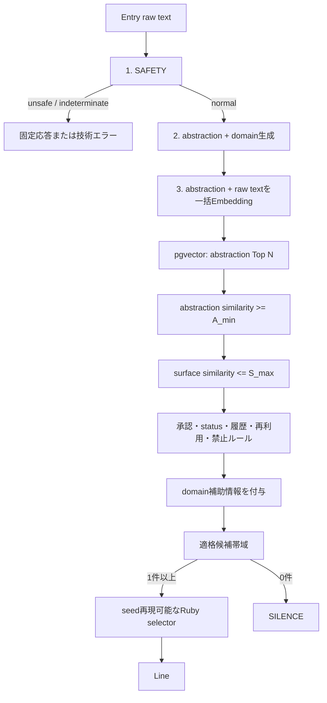

# B-v2 AI選定基本設計

**文書ステータス：PoC事前固定設計・follow-up後の現行仕様追補**

**PoC固定設計版：`b-v2-band-pass-design-v2`**

**現行仕様追補：Issue #63**

**作成日：2026年8月13日**

**関連Issue：#41 / Epic #40 / #59 / #61 / #63**

## 0. follow-up後の現行仕様

Epic #40で検証した固定構成の`architecture_rejected`は変更しない。Issue #59の帯域感度追補とIssue #61の軽量selector比較を踏まえ、B-v2のうち次の処理骨格を今後の基本方式として暫定採用する。

1. SAFETYを判定する。
2. Entryから`abstraction + domain`を生成する。
3. Entry abstractionをEmbeddingする。
4. Line側の事前生成済みabstraction embeddingから、本質的に近い候補を検索する。
5. Entry原文とLine本文のEmbedding similarityをsurface距離として計算する。
6. abstraction下限とsurface上限によるband-passで候補集合を作る。
7. Rails / Rubyでstatus、履歴、再利用条件、policy等を適用する。
8. 適格候補から版付き・再現可能なselectorでLineを選択する。
9. 正常処理後の適格候補が0件ならSILENCEとする。

リアルタイムLine評価LLMは使用しない。Line側のabstraction、domain、abstraction embedding、text embedding、policy / profile情報は、登録・承認時またはバッチで事前生成し、投稿時には生成しない。

### 0.1 PoC結果の位置づけ

- Epic #40の`A_min=0.45 / S_max=0.55 / Top N=20 / uniform`という固定構成は不採用である。
- Issue #59では正確な全pair similarityにより`0.425 / 0.425 / Top 10`付近で品質改善を確認したが、良好な領域は狭く、後付けで本番値には採用しない。
- Issue #61では、similarity、rank、domainだけを用いた6種類の軽量selectorのいずれもuniformを大きく上回らず、最終診断は`selector_gain_insufficient`だった。
- Blind人間評価を含むここまでの品質確認から、selectorの小さな重み差よりLine本文そのものの品質差が結果へ影響している可能性が高い。ただし、Issue #61で作成した17件のBlind packetは独立した評価証拠であり、完了前に特定selectorの採用根拠として扱わない。

したがって、**band-passという構造は維持するが、具体的な閾値とselectorは現Lineプールでは正式決定しない**。これはEpic #40の結果を覆すものではなく、follow-up診断から、残す設計骨格と再検討対象を分離したものである。

### 0.2 本番仕様として未確定の項目

- `A_min`
- `S_max`
- `Top N`
- 最終selectorとselector weight
- 本番Provider / model
- 最終domain taxonomy
- 本番`pgvector` index parameter
- 現Approved 96 Lineプール

`A_min / S_max / Top N / selector`は、Lineプールのブラッシュアップ後に再キャリブレーションして決定する。`0.425 / 0.425 / Top 10`は再検証の起点候補であり、既定値・推奨値・本番値ではない。

### 0.3 次フェーズ

次の開発・PoCフェーズはLineプールのブラッシュアップとする。その後、次の順で選定条件を再決定する。

1. 改善後のLine profileを再生成する。
2. Line abstraction / text Embeddingを再生成する。
3. 固定評価Entryとの全pair similarityを再作成する。
4. `A_min × S_max × Top N`を再スイープする。
5. 一点最適ではなく、安定したband-pass領域を決定する。
6. 同じ候補集合でselectorを再比較する。
7. Blind人間評価を含めて最終閾値・selectorを確定する。

Lineプール改善の効果と選定ロジック変更の効果を同じ比較で混ぜない。まずLineプールの版を固定し、その後にband-passとselectorを順番に評価する。

以下の第1〜19章は、Epic #40の結果を見る前に固定した設計・Gate・実施順を記録する。過去の判断を追跡できるよう本文を履歴として保持し、現在の仕様上の位置づけは本章を正とする。

## 1. 結論

B-v2の中心仮説を、次の帯域選択として固定する。

- `abstraction similarity >= A_min`：本質的に十分近い候補だけを残す。
- `surface similarity <= S_max`：Entry原文を言い換えるほど近い候補を除外する。
- domain：analogical transfer候補の発見・選択分布を補助するが、適格・不適格を決めない。
- Ruby業務ルール：status、承認状態、履歴、再利用禁止等を決定的に適用する。
- selector：最高得点1件を固定せず、適格帯域から保存したseedで再現可能に選ぶ。
- 適格候補0件：SILENCEとする。

投稿時の外部処理はSAFETY、abstraction + domain生成、Entry abstraction + raw textの一括Embeddingの最大3段階とする。リアルタイムLine評価LLMは使用しない。Line側のAI出力とEmbeddingは登録・承認時またはバッチで事前生成し、投稿時に再生成しない。

本書は設計を確定するもので、Provider、モデル、`A_min`、`S_max`、Top N、domain taxonomy、selectorを正式採用するものではない。これらは後続Issueで比較してライブ実行前に版固定する。

`v2`は`v1`作成後、B-v2に関する実験結果を一切見る前に、アーキテクチャ成立判定とLineプール改善後の製品品質判定を分離し、Issue #42の小規模APIスモークを追加した版である。`v1`のcriteria成果物とGit履歴は削除・改変せず保持する。

## 2. 背景と設計根拠

`selected-v1`は旧品質基準では高評価だったが、Reflective Distance再評価では保存済み98表示中71表示が`direct_restatement / too_close`だった。リアルタイムLine評価LLMを含むp95は約15秒だった。

`abstraction-only-v1-diagnostic`はp95 5.48768秒、投稿時約0.551円、Line評価LLM 0回を実現した。Reflective Distance最終許容率は54 / 108（50.00%）で不採用だった一方、`analogical_transfer`35表示はすべて許容だった。

この結果から、検索目的を「最も意味が近いLine」から「本質は近いが、表面は近すぎないLine」へ変更する。B-v2はabstraction-onlyという発想を捨てず、B-v1で不足したtoo-close除外を低コストなsurface similarity上限として追加する。

Reflective Distanceの人間確認では、低確信10種類中4種類でCodexとプロダクトオーナーの判断が異なった。論理的なstructure対応はobserbing品質の完全な代理にならないため、structure similarityを投稿時の必須条件や主スコアにしない。

## 3. スコープ

### 3.1 本Epicで扱う

- abstraction + domain表現の比較
- abstraction検索とsurface too-close filterの比較
- grounding / Line承認 / 投稿時業務ルールの再設計
- 適格候補からの軽量selector比較
- 現Approved 96 Lineを固定した実API統合PoC
- B-v1との品質・速度・費用比較
- B-v2をLineプール改善へ進めるアーキテクチャ候補とみなせるかのGate A判定

### 3.2 本Epicで扱わない

- Line本文の追加、削除、書き換え、品質改善
- 本番DB migration、インデックス構築、本番API実装
- 本番Provider、モデル、契約の正式決定
- 本番の閾値・domain taxonomyの正式決定
- リアルタイムLine評価LLMの再導入

最初の実API比較では現Approved 96 Lineを変更しない。選定方式変更とLineプール変更を同時に行わず、Gate Aで`architecture_candidate`となった場合はB-v2を固定baselineとして別EpicのLineプール改善へ進む。この時点では本番採用ではない。現96 Lineで製品品質の絶対基準に届かないことだけを理由に、改善効果のあるB-v2アーキテクチャを不採用にしない。

## 4. 設計原則

1. 類似度を単一の「高いほど良い」スコアとして扱わない。
2. abstractionは候補の下限、surfaceはtoo-close除外の上限として扱う。
3. surface similarityが低いほど良いとは扱わない。低すぎる候補はabstraction下限で落とす。
4. domain差を必須にしない。same-domainでも発見距離があれば適格である。
5. structureは保存・分析してよいが、投稿時の適格条件、重み、tie-breakに使わない。
6. AIは候補表現を返し、RailsがSchema、版、status、履歴、禁止条件、最終分岐を確定する。
7. AI障害や版不整合をSILENCEへ置き換えない。SILENCEは正常処理後の候補不成立だけに使う。
8. すべての閾値とselector版を結果閲覧前に固定し、選択TRACEへ残す。

## 5. 投稿時アーキテクチャ



### 5.1 外部処理

| 段階 | 入力 | 出力 | 外部リクエスト上限 |
|---|---|---|---:|
| SAFETY | Entry原文 | 構造化分類 | 1 |
| abstraction + domain | Entry原文 | 1つの構造化結果 | 1 |
| Embedding | `[entry_abstraction, entry_raw_text]` | 順序または入力IDに対応する2ベクトル | 1 |
| Line評価 | — | — | 0 |

通常フローは再試行を除き最大3外部リクエストとする。SAFETYと意味生成を別LLM Providerへfan-outしない。投稿時LLMは1 Providerを優先し、Embeddingも同一Providerで成立する構成を第一候補とする。Embeddingだけ別サービスにする場合も、データ取扱いと障害境界を個別に承認し、無条件の自動Provider切替は行わない。

### 5.2 Embedding一括化

Entry abstractionとEntry raw textは同じEmbeddingモデル・次元・正規化版を使い、配列入力を1リクエストで送る。レスポンスの順序だけに暗黙依存せず、Adapterで入力用途と出力indexの対応を検証する。

abstractionとraw textは用途が異なるため、同一ベクトルを流用しない。Line側も`abstraction_embedding`と`text_embedding`を別レコードまたは明確な`kind`で保持する。

## 6. abstraction / domain表現

投稿時生成Schemaの概念契約は次とする。

```json
{
  "schema_version": "b-v2-entry-profile-vX",
  "abstraction": "個別事実を減らした短い本質表現",
  "domain": {
    "primary": "decision",
    "secondary": ["expectation"],
    "taxonomy_version": "domain-vX",
    "confidence": 0.0
  }
}
```

`structure`を同じ応答で診断用に出す案は許容するが、投稿時の検索・filter・selectorへ渡さない。診断用出力を追加するとtoken、Schema失敗、レイテンシが増えるため、既定案はabstraction + domainだけとする。

### 6.1 domain taxonomy比較

| 案 | 長所 | 短所 | B-v2での扱い |
|---|---|---|---|
| 固定単一enum | 安定・実装容易 | 複合日記を失いやすい | 比較baseline |
| 固定複数値 | 複合性を保持 | 揺らぎと組合せ増加 | 第一候補 |
| 階層taxonomy | 距離・集約を表せる | 初期96 Lineには複雑 | 将来候補 |
| 自由語 | 表現力が高い | 版管理・比較が不安定 | 投稿時利用には不採用候補 |

第一仮説は`primary 1件 + secondary 0〜2件 + other`を持つ版付き固定語彙である。ただし語彙と単一/複数の採用はIssue #42で比較する。domain不明・低確信は中立として扱い、候補を除外しない。

例示語彙の`decision / relationship / work / time / space / object / solitude / expectation`は候補であり、正式enumではない。

## 7. Line側の事前処理

検索可能なLine profileは少なくとも次を持つ。

| 項目 | 用途 |
|---|---|
| `line_id` / `text` / `status` | 本文・状態の正本 |
| `abstraction` | 本質検索キー |
| `domain_primary` / `domain_secondary` | 選択分布の補助 |
| `text_embedding` | surface too-close判定 |
| `abstraction_embedding` | pgvector候補検索 |
| `profile_version` / `taxonomy_version` | 生成契約の識別 |
| `embedding_model` / `dimensions` / `embedding_version` | ベクトル互換性 |
| `source_text_sha256` | 本文と事前生成物の対応確認 |
| `policy_flags` / `approval_state` | Line承認時保証 |

Line登録、本文変更、または生成版変更時に非同期ジョブでabstraction、domain、2種類のEmbeddingを生成する。Schema、次元、版、本文hash、禁止属性を検証し、すべて成功して承認されたprofileだけを検索対象にする。本文が変わった場合は古いprofileを検索対象から外す。

Line側の生成token・Embedding利用量・再生成回数・費用は`line_precompute_cost`として投稿時費用から分離する。投稿リクエスト中に欠損profileを生成してはならない。

## 8. pgvector候補検索

B-v2は全LineをRubyで総当たりしない。概念クエリは次の順序とする。

1. `status=approved`、profile準備済み、同じEmbedding版に限定する。
2. Entry abstraction embeddingでcosine近傍Top Nを取得する。
3. `abstraction_similarity >= A_min`を満たす候補だけを残す。
4. 取得候補だけEntry raw text embeddingとLine text embeddingのsurface similarityを計算する。
5. `surface_similarity > S_max`をtoo-closeとして除外する。
6. Railsの履歴・再利用・禁止ルールを適用する。

`A_min`、`S_max`、Top N、cosine以外の距離方式はIssue #43の比較対象とし、Issue #46のライブ実行前に版固定する。異なるモデル、次元、正規化版のベクトルは比較しない。

PostgreSQLでは`line_embeddings(kind=abstraction)`へcosine用HNSWまたはIVFFlat indexを検討する。surface similarityはTop Nだけに計算するため、全text embedding用ANN indexを必須としない。実装時はCTE等でabstraction Top Nを先に確定し、その候補にだけsurface計算を行う。

インデックス方式、Top N上限、検索p95、再index手順は実データ規模で決定する。本Issueではmigrationを作らない。

## 9. domainの利用境界

domainは次にのみ使用できる。

- same-domain / cross-domain候補数の診断
- selector比較時の有限で明示的なweight補助
- 直近表示のdomain偏りを避けるdiversity補助
- Reflective Distance評価のrelation分布との事後分析

次には使用しない。

- domain一致・不一致によるhard include / exclude
- abstraction下限またはsurface上限の迂回
- 異なるdomainほど無制限に高得点とする単調スコア
- structure similarityの代理

domainが未決定、`other`、低確信、複数一致の場合は中立weightとする。domain補助の最大影響を設定で上限化し、候補の本質的近さを逆転させない。

## 10. grounding / Line policyの再設計

`combined_v1`は本番候補としてそのまま継承しない。人物・数量・物・場所がEntryにないことだけでは除外しない。E001 / L083とE033 / L102のような独立した具体例はanalogical transferになり得る。

### 10.1 Line承認時に保証する

- ユーザーへ向けた未根拠の事実断定を行わない。
- 助言、指示、診断、人格・感情断定、説教、称賛、強い誘導を行わない。
- 明らかな禁止Line、攻撃的表現、個人情報、固有の第三者事実を含めない。
- 一般表現、比喩、独立した情景、数量例は、それ自体を禁止しない。
- `assertion_target`、`speech_act`等のpolicy metadataを版付きで検証する案をIssue #44で比較する。

### 10.2 投稿時に保証する

- Line / profileがApprovedかつ検索可能である。
- ユーザーへの事実断定として機能する候補を除外する。
- Entryの明示事実と矛盾する候補を除外する。
- 同一Line再利用禁止、直近利用、禁止属性、Retiredを決定的に除外する。
- 除外理由をTRACEへコードとして保存する。

人間に向けた意味判断を静的語彙だけで完全に実現できるとは仮定しない。投稿時LLMを追加しない代わりに、Lineプールを「ユーザー事実を断定しない独立表現」に限定する承認時保証を主防御層とし、投稿時は比較可能なmetadataと明示ルールへ絞る。最終契約はIssue #44で固定する。

## 11. 適格候補とselector

候補`c`の適格条件は概念上、次のANDである。

```text
approved_profile(c)
AND compatible_embedding_version(c)
AND abstraction_similarity(c) >= A_min
AND surface_similarity(c) <= S_max
AND runtime_policy_pass(c)
AND history_and_reuse_pass(c)
```

domain差はこの式へ入れない。適格候補集合に1件以上あればselectorへ渡し、0件ならSILENCEとする。候補不足時に`A_min`や`S_max`を自動緩和しない。

Issue #45では次を比較する。

| selector | 特徴 | 注意点 |
|---|---|---|
| uniform random | 適格候補を等確率 | 品質差を利用しない |
| abstraction weighted random | 本質が近い候補を有限範囲で優遇 | Top 1化しないweight上限が必要 |
| domain-diversity assisted random | 直近domain偏りを有限範囲で緩和 | domain差を品質と誤認しない |

同じEntry profile、候補集合、履歴snapshot、selector版、seedなら同じ結果を返す。PoCは固定seedを使用する。本番ではRailsがseedを生成してTRACEへ保存し、再現可能性と表示の多様性を両立する。履歴ルールの具体的な期間・件数は要件定義書とIssue #44を正とする。

## 12. エラーとSILENCE

| 状態 | 分岐 |
|---|---|
| SAFETY unsafe | 通常Lineを出さず固定安全応答 |
| SAFETY判定不能 / 外部障害 | 技術エラー |
| abstraction / domain Schema不正 | 規定内の再試行後、技術エラー |
| Embedding失敗・件数/次元不一致 | 技術エラー |
| ベクトル版不一致 | 設定エラーとして中止 |
| DB / pgvector失敗 | 技術エラー |
| 正常処理後の適格候補0件 | SILENCE |
| selector不変条件違反 | 技術エラー |

技術エラーをSILENCEへ数え替えない。投稿枠の確定、再試行、ユーザー文言は既存AI基本設計と要件定義書に従う。

## 13. 評価設計

### 13.1 データと比較順序

1. 現在の固定合成Entry 36件とApproved 96 Lineを使う。
2. Line本文、status、承認集合を変更しない。
3. Issue #42のPhase 1で表現方式をオフラインで絞り、Phase 2で小規模APIスモークを行う。
4. Issue #44を#42と並行し、Issue #43・#45は保存成果物を用いてオフライン比較する。
5. #46のライブ結果を見る前にprofile、Embedding、閾値、selector、taxonomy、guardの各版を固定する。
6. Issue #46で現96 Lineのまま36 Entry × 3反復をライブ実行する。
7. Issue #47でB-v1保存結果と同じ`reflective-distance-v1`により比較する。
8. Issue #48でGate Aを判定する。
9. `architecture_candidate`の場合、Issue #49で固定baselineを作り、別EpicのLineプール改善後にGate Bを評価する。

オフライン調整とライブ評価が同じ合成36 Entryを使うため、一般化性能を証明する試験ではない。Gate Aはアーキテクチャ成立候補を判断するPoC gateであり、本番採用判断ではない。Gate B前後には別のholdoutまたは実データ相当評価を追加する。

### 13.2 Issue #42：表現方式の小規模APIスモーク

Issue #42は次の2 Phaseに分ける。

#### Phase 1：オフライン設計比較

外部APIを使わず、固定enum、`primary + secondary`、`unknown / other`、Schema、Prompt、validation、versioningを比較する。実APIへ出す候補は最大2版に絞る。この段階では本番候補を確定しない。

#### Phase 2：小規模実APIスモーク

固定した合成データ10件を、候補最大2版、各3反復で生成する。

- Entry 6件：`E001 / E003 / E008 / E023 / E032 / E035`
- Line 4件：`L021 / L083 / L102 / L118`
- 通常予定：10対象 × 最大2候補 × 3反復 = 最大60リクエスト
- retry：失敗した各リクエストにつき最大1回、retry込み最大120リクエスト
- token上限：入力・出力合計50,000 token
- 費用上限：500円

このsubsetは、単一・複合・境界domain、analogical transfer、人間/Codex判断差、人物・数量を含む独立表現、短文・長文を含む。目的は最終Line品質の判定ではなく、abstraction品質、domain妥当性、3反復安定性、Schema成功率、primary / secondaryの入替、unknown / other率、元文にない事実追加、domain追加前の保存済みabstractionからの劣化、latency、token、費用を早期確認することである。

API実行前に、Provider、model、契約、候補版、対象ID、反復数、通常・retry込みリクエスト上限、token上限、単価、最大費用、送信データ、保存成果物をpreflight成果物へ固定してコミットする。費用見積りが500円を超える構成は実行しない。送信するのは固定合成本文と版付きPrompt / Schemaだけとし、APIキーは表示・保存しない。保存するのは正規化したabstraction / domain、Schema結果、版、usage、latency、費用および評価であり、認証情報や不要なProvider生レスポンスを保存しない。

#43は#42の保存出力を診断入力として再利用できるが、追加外部APIを実行せず、少数subsetへ過適合させない。#46前に36件のオフライン評価で`A_min / S_max / Top N`を固定する。

### 13.3 Gate A：B-v2アーキテクチャ成立判定

Gate Aは、現96 Lineの製品品質を認定するものではない。B-v1診断baselineと同じLineプール・同じ`reflective-distance-v1`で、帯域選択の改善効果と毎投稿運用可能性を判定する。

比較baselineは`abstraction-only-v1-diagnostic`の保存済み108表示とする。

| baseline指標 | 値 |
|---|---:|
| acceptable outcome | 54 / 108（50.00%） |
| `direct_restatement / too_close` | 29 |
| `too_far` + `unrelated` | 25 |
| acceptableな`analogical_transfer` | 35 / 35 |

`architecture_candidate`には、次をすべて要求する。

- acceptable outcome率70%以上（76 / 108以上）、かつbaseline 50.00%から20ポイント以上改善
- `direct_restatement / too_close`をbaselineから30%以上削減（20件以下）
- `too_far + unrelated`をbaseline比+5ポイント以内（30件以下）、かつ`unrelated`12件以下
- acceptableな`analogical_transfer`をbaselineの90%以上保持（32件以上）、かつanalogical内acceptable率90%以上
- 3反復すべてacceptableのEntry率50%以上（18 / 36以上）
- semantic SILENCE率20%以下（21 / 108以下）
- `user_fact_assertion / explicit_contradiction / advice_or_diagnosis`各0件
- 既存normal EntryのSAFETY過剰遮断0件、完了フロー技術エラー0件、未解決low confidence 0件
- End-to-End p95 6秒以下、投稿時費用1円以下、通常時外部リクエスト3以下、Line評価LLM 0回

判定は次の3値とする。

| 判定 | 意味 |
|---|---|
| `architecture_candidate` | 上記をすべて満たす。方式版を固定し、Lineプール改善Epicへ進める。本番採用ではない。 |
| `further_selection_poc_required` | 安全・API・費用・速度の必須条件は満たすが、候補基準の一部が境界、または技術エラー等で比較が不成立。現Lineプールのまま追加選定PoCを行う。 |
| `architecture_rejected` | 安全必須条件または運用予算に違反する、acceptable改善が10ポイント未満、too-close削減が20%未満、acceptable analogical保持が60%未満、または`too_far + unrelated`が35%を超える。 |

70%または80%を単独で判定しない。例えば70%で製品品質80%に届かなくても、上記の改善・距離分布・analogical・反復・安全・速度・費用条件を満たせば`architecture_candidate`となる。結果を見た後にこの条件を変更しない。

### 13.4 Gate B：Lineプール改善後の製品品質判定

`acceptable_outcome_rate`を、全normal実行枠に対する最終`acceptable=true` Line数として定義する。SILENCEと技術エラーはacceptableとして数えない。これにより、低品質候補をSILENCEへ逃がして率を上げられない。

- 必須：80%以上（108実行なら87件以上）
- 目標：90%以上（108実行なら98件以上）

これはGate A通過後、B-v2の方式版を固定してLineプールを改善した後に適用する製品品質基準である。現96 LineのGate Aで80%未達だったことだけをB-v2アーキテクチャの棄却理由にしない。

旧PoCの90%はtoo-closeを許容し得る別の指標だった。B-v2では`direct_restatement / too_close`も不許容であるため、80%を製品品質の必須線、90%を目標線として固定する。

#### Gate Bの反復安定性

同じLineが再現されることを成功条件にしない。各Entryについて3反復すべてがacceptable outcomeだった割合を測る。

- 必須：60%以上（36 Entryなら22件以上）
- 目標：75%以上（36 Entryなら27件以上）

#### Gate Bの必須不適合

108表示全体で次を各0件とする。

- `user_fact_assertion`
- `explicit_contradiction`
- `advice_or_diagnosis`

未解決low confidenceは0件とする。Codex一次評価のlow confidence、必須不適合候補、さらにrelation / distanceを層化した最低24表示を人間確認し、Codexとの判断差を別集計する。

### 13.5 共通の分布と診断

次は必ず報告するが、件数を採用ノルマにしない。

- distance：`just_right / too_close / too_far / not_obserbing`
- relation：`analogical_transfer / same_domain / direct_restatement / weak_connection / unrelated`
- semantic SILENCE率：必須20%以下、目標10%以下
- 適格候補数のp50 / p95 / 0件率
- domain一致・不一致・不明の各許容率
- Top N候補回収と閾値感度
- Top20 Jaccard、最終Line完全一致率は診断のみ

Gate Aではbaselineを壊していないことを確認するため、acceptableなanalogical transferの保持基準を使う。これはdomain差や遠さを増やす生成ノルマではない。Gate Bでは固定件数ノルマを置かず、主品質と必須不適合を満たした上で分布を解釈する。

### 13.6 Gate AからLineプール改善への引き渡し

Issue #48が`architecture_candidate`を記録した場合、Issue #49は次を一つの不変baseline manifestとして固定する。

- B-v2のprofile版
- Embedding Provider / model / dimensions / 正規化を含むEmbedding版
- `A_min / S_max / Top N`
- selector版とweight、seed規則
- domain taxonomy版
- guard / policy版
- 現Approved 96 LineのID、本文、statusから計算したhash

別Epicはこの方式baselineを変えずにLineプールだけを改善し、`B-v2 + 現96 Line`と`B-v2 + 改善Lineプール`を比較する。方式変更が必要になった場合はLineプール改善と同じ比較へ混ぜず、別版・別評価として扱う。

## 14. 性能・費用・運用基準

| 指標 | 必須 | 目標 | 備考 |
|---|---:|---:|---|
| End-to-End p95 | 6秒以下 | 5秒以下 | B-v1ライブ5.48768秒を基準点 |
| 投稿時費用 | 1円以下 | 0.7円以下 | B-v1約0.551円を基準点 |
| 通常時外部リクエスト | 3以下 | 3以下 | retryは別集計 |
| リアルタイムLine評価LLM | 0 | 0 | 必須不変条件 |
| 投稿時LLM Provider | 1以下 | 1 | Embeddingサービスは別記録 |
| 初回Schema成功率 | 99%以上 | 100% | SAFETYとprofile生成 |
| 既存通常Entry SAFETY過剰遮断 | 0 | 0 | 固定データ |
| 完了フロー技術エラー | 0 | 0 | SILENCEと分離 |
| pgvector + Ruby処理p95 | 250ms以下 | 100ms以下 | AI待ち時間を除く診断予算 |

費用は投稿時処理、評価用オフラインjudge、Line事前生成を分離する。Epic #40の有料外部API累計上限を2,000円とし、Issue #42へ最大500円、Issue #46へLine事前生成を含む最大1,500円を割り当てる。#43〜#45、#47〜#49は保存成果物を用い、外部API 0回を既定とする。各実API Issueは実行前に最大リクエスト数・retry込み上限・token・単価・最大費用をpreflight成果物へ固定し、上限超過見込みなら実行しない。

## 15. 将来DBイメージ

概念テーブルを示す。命名とmigrationは詳細設計で決定する。

```text
lines
  id, text, status, text_sha256, ...

line_ai_profiles
  line_id, profile_version, abstraction,
  domain_primary, domain_secondary[], taxonomy_version,
  policy_flags, approval_state, source_text_sha256

line_embeddings
  line_id, kind(text|abstraction), provider, model,
  dimensions, embedding_version, vector, source_sha256, ready_at

entry_ai_profiles
  entry_id, profile_version, abstraction, domain_json, ...

entry_embeddings
  entry_id, kind(raw_text|abstraction), embedding_version, vector, ...

line_selection_traces
  entry_id, profile_version, embedding_version,
  threshold_version, selector_version, seed,
  top_n_count, eligible_count, selected_line_id,
  exclusion_reason_counts, outcome
```

Entry原文、profile、Embeddingは個別ユーザーデータとして扱い、削除連動・アクセス制御・通常ログ非出力を維持する。TRACEには本文やベクトルを複製せず、ID、版、数値、reason codeだけを保存する。

## 16. 可観測性

投稿ごとに次を本文なしで記録する。

- 処理別Provider / model / version / request ID
- token、Embedding input units、費用、duration、retry
- abstraction候補数、`A_min`通過数、too-close除外数
- policy / status / history除外数
- domain bucket件数、適格候補数
- selector版、seed、選択Line IDまたはSILENCE reason
- vector / threshold / taxonomy / profileの各version

評価では投稿時費用、Line事前生成費用、Blind/Codex/人間評価費用を別々に集計する。

## 17. 未決定事項

| 未決定 | 決定Issue |
|---|---|
| abstraction prompt / Schemaの確定版 | #42 |
| domain taxonomy、単一/複数、unknown | #42 |
| profile生成Provider / model | #42 Phase 1後、Phase 2 preflight |
| Embedding Provider / model / dimensions | #43、#46 |
| `A_min`、`S_max`、Top N、距離方式 | #43 |
| Line policy metadataと投稿時guard契約 | #44 |
| 履歴・直近利用の具体値 | #44 |
| selectorとweight上限 | #45 |
| SAFETY Provider・model | #46 |
| timeout / retryの具体値 | #46 |
| pgvector HNSW / IVFFlatとindex parameter | 実装前性能検証 |
| 本番閾値、契約、監視alert | #47、#48以降 |

## 18. Epic #40の実施順

| 順序 | Issue | 成果 |
|---:|---|---|
| 1 | #41 | 本書、Gate A / B、事前評価基準を固定 |
| 2a | #42 | abstraction + domainをオフライン比較し、小規模実APIスモーク |
| 2b | #44 | grounding / 業務ルールを再設計 |
| 3 | #43 | abstraction下限 + surface上限をオフライン比較 |
| 4 | #45 | 適格候補selectorを比較 |
| 5 | #46 | 現96 Line・36 Entry × 3反復でB-v2本統合実API PoC |
| 6 | #47 | B-v1と品質・速度・費用比較 |
| 7 | #48 | B-v2アーキテクチャGate A判定 |
| 8 | #49 | Gate A成立時に固定baselineを作りLine改善Epicへ接続 |

次に最初に実施するIssueは#42である。#44は#41完了後に#42と並行可能だが、#43は#42の表現版固定を待つ。

## 19. 今回の実行制約

Issue #41では設計と事前基準だけを作成した。`v1`作成後、B-v2の実験結果を見る前にGate A / Bと#42スモークを追加して`v2`へ改訂した。OpenAI、Anthropic、Embedding、SAFETY、abstraction生成、Line再選定、その他有料外部APIの呼び出しは0回である。Line、既存Embedding、DB schemaは変更していない。
