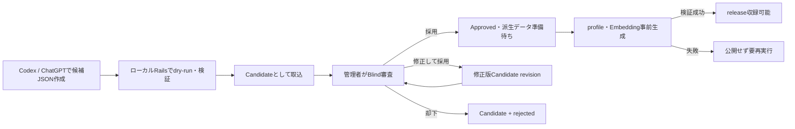

# Lineプール基本設計

**文書ステータス：現行設計**

**版：`line-pool-design-v1`**

**作成日：2026年8月17日**

## 1. 目的

本書は、obserbingで使用するLineプールについて、候補作成、人間による審査、版固定、ステージング・本番への反映、廃止および監査の基本設計を定義する。

Lineの品質改善をローカル環境で完結させ、承認済みの同一リリースをステージングと本番へ再現可能かつ安全に展開できることを目的とする。

## 2. 上位ドキュメントとの関係

本書は次の現行文書に従う。

- [要件定義書](../../requirements/要件定義_v1_0.md)
- [AI基本設計](../AI基本設計.md)
- [Rails基本設計](../Rails基本設計.md)
- [B-v2 AI選定基本設計](B-v2_AI選定基本設計.md)
- [Reflective Distance 評価ルーブリック](../../evaluation/Reflective_Distance_評価ルーブリック.md)

上位文書と本書が矛盾する場合は上位文書を優先する。本書はLineプールの管理方式を定めるものであり、EntryからLineを選ぶ方式、`A_min`、`S_max`、Top N、selector、domain taxonomyの具体値は確定しない。

## 3. スコープ

### 3.1 本書で扱う事項

- Line本文と付随情報の品質基準
- `Candidate / Approved / Retired`のライフサイクル
- CodexまたはChatGPTで作成したJSONのローカル取込
- Rails管理画面での人間審査
- Line revisionと過去TRACEの整合性
- Lineプールリリースの作成、検証、配布、反映およびロールバック
- Line profileとEmbeddingの事前生成および版管理
- 現行PoC Lineから初回プールへの移行
- 監査、認証、テストおよび運用上の不変条件

### 3.2 本書で扱わない事項

- 日記投稿時のLine選定ロジック
- Entry profileの生成契約
- SAFETY固定応答とSILENCE本文
- Gap検出・クラスタリングの具体的な算出方式
- 最終的なEmbedding Provider、モデル、次元および検索閾値
- Active Record、migration、画面レイアウトの物理詳細

これらは上位設計または個別の詳細設計で定める。

## 4. 設計原則

1. **品質を数量より優先する。** 件数を満たすために不適切なLineをApprovedにしない。
2. **AIは候補を作り、人間が公開を決める。** AI、Codex、インポート処理は自動承認しない。
3. **ローカルで編集し、版固定した成果物だけを配布する。** ステージング・本番の管理画面から本文を直接編集しない。
4. **Git管理するリリースを内容の正本とする。** 環境DBを正本にしない。
5. **公開済み本文を破壊的に上書きしない。** 修正は新しいrevisionとして審査する。
6. **派生データを本文と版で結び付ける。** profileとEmbeddingは本文hashおよび生成版が一致する場合だけ利用する。
7. **リリースを不変にする。** 公開済みrelease IDの内容を書き換えない。
8. **プール変更と選定ロジック変更を同じ品質比較へ混ぜない。** 一方を固定してから他方を評価する。

## 5. 正本とデータ配置

| データ | 役割 | Git管理 | 本番での編集 |
|---|---|---:|---:|
| ローカルRails DB | Candidate作成・編集・審査用の作業領域 | しない | 対象外 |
| 候補JSON | CodexまたはChatGPTからローカルへ渡す一時入力 | しない | しない |
| Lineプールrelease | Approved / Retiredの版固定された内容の正本 | する | しない |
| ステージング・本番DB | releaseを展開した検索・参照用projection | しない | しない |
| `poc/`配下のLine | 過去の検証データと意思決定履歴 | 維持する | しない |

候補JSONは`backend/tmp/line_pool/candidates/`へ置く。`backend/tmp/`はGit管理外であり、候補の試行錯誤や却下内容を意図せず公開しない。

版固定したreleaseは次の構成を基本とする。

```text
backend/db/line_pool/releases/
└─ line-pool-v1.0.0/
   ├─ manifest.json
   ├─ lines.json
   ├─ profiles.json
   └─ embeddings.json.gz
```

- `manifest.json`はrelease ID、件数、生成版および各ファイルのSHA-256を保持する。
- `lines.json`はLine identity、revision、本文、状態、出自および審査情報を保持する内容の正本とする。
- `profiles.json`はabstraction、domainおよびpolicy metadataを保持する。
- `embeddings.json.gz`は事前生成済みベクトルを保持する再生成可能な派生成果物とする。
- 派生成果物を将来Gitで扱えない規模になった場合は、`manifest.json`のchecksum契約を維持したまま非公開artifact storageへ移行できるものとする。

## 6. 概念モデル

### 6.1 Line identityとrevision

Lineは次の二層で扱う。

| 概念 | 役割 |
|---|---|
| Line identity | リリース間で変わらない同一性。`line_key`で識別する |
| Line revision | 特定時点の本文と検索用属性。`line_key + revision`で識別する |

`line_key`はRailsが生成するUUIDとし、DBの連番IDや配列位置を外部識別子にしない。revisionは1から始まる単調増加整数とする。

Approved本文を修正するときは、同じ`line_key`に新しいCandidate revisionを作る。旧Approved revisionは、新revisionを含むreleaseが有効になるまで検索可能な状態を維持する。新版の有効化後も旧revisionを削除せず、過去TRACEから参照できる状態を保つ。

TRACEはLine identityだけでなく、表示時のLine revisionを参照する。これにより、将来の本文修正が過去TRACEの表示を変えない。

### 6.2 状態と審査結果

Line revisionの状態は上位要件どおり次の3種類とする。

| 状態 | 意味 | 通常検索 |
|---|---|---:|
| `Candidate` | 審査前または審査中 | 対象外 |
| `Approved` | 人間が採用したrevision | active releaseかつ派生データ準備済みの場合だけ対象 |
| `Retired` | 今後の通常利用を停止したrevision | 対象外 |

却下はLine状態を増やさず、Candidateに対するreview outcomeとして`rejected`を記録する。却下済みCandidateは通常の審査待ち一覧から除外するが、監査目的で保持する。

審査結果は少なくとも次を持つ。

- `pending`
- `approved`
- `rejected`
- `retired`

### 6.3 概念データ

物理テーブル名は詳細設計で決定するが、少なくとも次を表現できる構造とする。

```text
Line
  line_key

LineRevision
  line_key, revision, text, status, text_sha256
  source_kind, source_reference, created_at

LineReview
  line_key, revision, outcome, reason
  reviewer, reviewed_at, policy_version

LineAiProfile
  line_key, revision, abstraction
  domain_primary, domain_secondary
  taxonomy_version, policy_flags, profile_version
  source_text_sha256

LineEmbedding
  line_key, revision, kind(text|abstraction)
  provider, model, dimensions, embedding_version
  source_text_sha256, vector, ready_at

LinePoolRelease
  release_id, previous_release_id, manifest_sha256
  status, created_at, activated_at

LinePoolReleaseItem
  release_id, line_key, revision, status
```

## 7. Line本文の品質基準

### 7.1 形式

初期日本語版では次を満たすことを必須とする。

- 前後の空白を除き8〜80文字とする。
- 改行を含めず、一つの論理的な文または断片として成立させる。
- URL、メールアドレス、電話番号、ハッシュタグ、メンションおよび絵文字を含めない。
- 個人を特定し得る情報、実在人物・組織・商品等の不要な固有名詞を含めない。
- 文字列はUTF-8、Unicode NFCとして保存する。
- 句読点の有無は統一のためだけに機械補正せず、本文の表現として人間が判断する。

文字数はUnicodeの書記素単位で数える。入力時に前後空白を除去する以外、承認済み本文を自動変換しない。

### 7.2 obserbingとして求める性質

Lineは次の性質を持つことを目指す。

- 日記の答え、要約または単純な言い換えではない。
- 意味を完成させず、投稿者が短い内省で接続を見つける余白がある。
- 名言、格言、教訓または「いいことを言おうとしている感じ」に寄りすぎない。
- 同じ具体領域でも、別領域の比喩・情景でも成立し得る。
- 一般表現、比喩、独立した情景を、ユーザー本人の事実として語らない。
- 特定のEntryがなくても、独立した一行として不自然でない。

### 7.3 禁止する表現

次のいずれかに該当するLineはApprovedにしない。

- ユーザーの感情、動機、人格、能力、関係または状況の断定
- 助言、命令、行動指示、説教、説得または強い誘導
- 診断、治療、医療・法律・金融等の専門的判断
- 励まし、称賛、慰めまたは前向きな意味の押し付け
- ユーザーへ直接答えを求める質問や、回答方向を誘導する問いかけ
- 根拠のない数量、因果、普遍命題または疑似統計
- 差別、攻撃、脅迫、自傷・他害の助長、性的またはその他の不適切表現
- 定型句や著名な引用の無断転用
- 特定のEntryや個人情報を前提にしなければ成立しない表現

具体的な物、場所、数量を含む比喩や独立した情景は、それだけを理由に禁止しない。`user_fact_assertion`と`analogical_transfer`を区別して審査する。

### 7.4 重複と類似

- Unicode正規化と前後空白除去後の完全一致は登録を拒否する。
- 同じ`line_key`内で本文hashが同一のrevisionは作成しない。
- 既存Lineとの意味的類似度が高い候補は警告し、近傍Lineを審査画面へ表示する。
- 類似度だけで自動却下しない。表現、構造、利用可能な距離が実質的に同じかを人間が判断する。
- 類似警告のモデル、閾値および判定版は記録し、Lineプールの分布確認前に固定する。

## 8. Candidate作成と取込

### 8.1 初期方針

MVPでは、Railsから外部LLM APIを呼んでCandidateを生成しない。次の方法を採用する。

1. Codexを主手段として、既存プール、設計書、品質基準およびGapの匿名集計を参照し、候補JSONをローカル生成する。
2. 自由な発想出しが必要な場合は、ChatGPTで作ったJSONも同じSchemaでアップロードできるようにする。
3. RailsはJSONを検証し、すべてCandidateとしてローカルDBへ保存する。
4. 管理者が管理画面で採用、修正して採用、却下を行う。

ChatGPTの契約とOpenAI APIの契約を同一とみなさない。Candidate作成のためだけにRailsへOpenAI APIキーを必須化しない。

### 8.2 Candidate JSON

Candidate JSONは次の形を基本とする。

```json
{
  "schema_version": "line-candidate-v1",
  "batch": {
    "batch_key": "2026-08-17-selection-gap-01",
    "source_kind": "codex",
    "instruction_version": "line-candidate-instruction-v1",
    "generated_at": "2026-08-17T00:00:00Z"
  },
  "candidates": [
    {
      "client_key": "candidate-001",
      "text": "選ばなかった方も、しばらく隣を歩く。",
      "suggested_metadata": {
        "abstraction": "選択後にも残る別の可能性",
        "domains": ["decision"]
      },
      "generation_note": "選択に関する不足領域の候補"
    }
  ]
}
```

- 一度のインポートは最大100件とする。
- `client_key`はバッチ内で一意とし、再インポートの冪等キーに使用する。
- `suggested_metadata`は審査補助であり、検索用profileの正本として信用しない。
- Candidate JSONに`Approved`等の状態が含まれていても無視し、サーバー側で必ずCandidateにする。
- 日記原文、Account ID、Entry IDその他の個人へ再結合できる情報を含めない。
- 同一`batch_key + client_key`の再取込は重複作成せず、同じ結果を返す。

### 8.3 Codexへ渡す情報

Codexには次だけを渡す。

- 本書と現行の評価ルーブリック
- 現在のLineプールと近傍重複情報
- 個人へ再結合できないGap集計
- 生成件数、対象不足領域、禁止事項および出力Schema

個々の日記原文をCandidate生成に使用しない。生成指示の版、生成元、対象不足領域およびバッチキーを記録する。

## 9. 管理画面

### 9.1 画面と操作

管理画面はRails Views / Hotwireで実装し、少なくとも次を提供する。

| 画面 | 主な機能 |
|---|---|
| Candidate取込 | JSON選択、Schema検証、dry-run、取込結果表示 |
| Candidate一覧 | pending / rejected、生成元、作成日、警告で絞り込み |
| Candidate詳細 | 本文、品質チェック、類似Line、suggested metadataを確認 |
| Approved一覧 | active release、revision、profile・Embedding準備状態を確認 |
| Retired一覧 | 廃止理由、廃止release、過去revisionを確認 |
| Release一覧 | 差分、件数、checksum、dry-run、反映状態を確認 |

Candidate詳細では次の操作を行う。

- 採用
- 本文を修正して採用
- 却下
- 審査保留

Approved Lineに対しては次を行う。

- 新しいCandidate revisionを作成する
- 次releaseからRetiredにする

本文の品質を先入観なく判断できるよう、初回審査時は生成元、生成指示、旧評価、Themeおよびsuggested metadataを既定で隠す。審査判断後または管理者が明示的に展開した場合だけ表示する。

### 9.2 認証と認可

MVPの管理画面は単独管理者を前提にBasic認証を使用する。

- `/admin`配下だけにBasic認証を適用する。
- 本番・ステージングではHTTPSを必須とする。
- ユーザー名と十分に長いランダムなパスワードを環境別secretから注入する。
- 認証情報をリポジトリ、HTML、ログまたは例外本文へ出力しない。
- 状態変更はPOST / PATCH / DELETEとCSRF protectionを必須とする。
- 管理画面のレスポンスは共有cacheへ保存しない。
- 可能な環境ではIP制限を追加する。

Basic認証は単独管理者向けのMVP境界である。複数管理者、権限分離、MFAまたは管理者ごとの強い監査が必要になった時点で、セッションベースの管理者認証へ移行する。

## 10. 審査フロー



採用操作と検索公開を分離する。人間がApprovedと判断しても、profileと2種類のEmbeddingが揃い、Schema、版、次元、本文hashおよびpolicyを検証できるまでreleaseへ収録しない。

「修正して採用」は、修正後本文を一度Candidate revisionとして保存し、同じ品質検証を通したうえでApprovedにする。修正操作だけで検証を迂回しない。

## 11. profileとEmbedding

### 11.1 生成タイミング

Line profileとEmbeddingは次の場合にローカルrelease buildで生成する。

- CandidateがApprovedになったとき
- Approved本文の新revisionを採用したとき
- profile、taxonomy、policyまたはEmbedding生成版を更新したとき

Candidateの全件に有料外部APIを実行せず、Approvedになった内容だけを対象にする。生成前に最大件数、retry込みリクエスト数、モデル、入力規模および費用上限をpreflight結果へ固定する。

### 11.2 生成物の整合性

検索可能なrevisionは次をすべて満たすこと。

- `status=Approved`
- active releaseに含まれる
- abstractionとpolicy metadataがSchemaに適合する
- text Embeddingとabstraction Embeddingが存在する
- profile、EmbeddingおよびLine本文のSHA-256が一致する
- 検索設定が要求するモデル、次元および版と一致する
- 未解決のpolicy違反またはlow confidenceがない

異なるEmbeddingモデル、次元、正規化版を同じ検索で混在させない。モデル変更時は新しいreleaseを作り、全対象Lineの派生データが揃ってからrelease単位で切り替える。

### 11.3 環境への配布

初期方針では、profileとEmbeddingをローカルで一度生成し、checksum付きのrelease成果物として配布する。ステージング・本番のimport処理からCandidate生成、profile生成またはEmbedding APIを呼ばない。

これにより、ステージングと本番で同じ派生データを利用し、外部APIの重複課金、出力差およびデプロイ時の外部障害を避ける。派生成果物に秘密情報や日記原文を含めない。

## 12. Release

### 12.1 release ID

release IDは`line-pool-vMAJOR.MINOR.PATCH`形式とする。

- `MAJOR`：Schemaまたは互換性を壊す変更
- `MINOR`：Approved Line追加、本文revision更新、Retired追加
- `PATCH`：内容を変えない派生データ再生成またはmetadata修正

一度作成したrelease IDのファイル内容は変更しない。修正が必要な場合は新しいrelease IDを作る。

### 12.2 manifest

`manifest.json`は少なくとも次を持つ。

```json
{
  "schema_version": "line-pool-release-v1",
  "release_id": "line-pool-v1.0.0",
  "previous_release_id": "line-pool-v0.9.0",
  "created_at": "2026-08-17T00:00:00Z",
  "counts": {
    "approved": 500,
    "retired": 12
  },
  "versions": {
    "profile": "line-profile-v1",
    "policy": "line-policy-v1",
    "taxonomy": "line-taxonomy-v1",
    "embedding": "line-embedding-v1"
  },
  "files": [
    { "path": "lines.json", "sha256": "..." },
    { "path": "profiles.json", "sha256": "..." },
    { "path": "embeddings.json.gz", "sha256": "..." }
  ]
}
```

時刻はUTCのISO 8601で記録する。JSONのcanonicalizationとrelease全体hashの算出規則は実装前にfixtureとともに固定する。

### 12.3 release内容

- Candidateおよびrejected Candidateを含めない。
- activeなApproved revisionと、履歴維持に必要なRetired revisionを含む累積snapshotとする。
- 同一`line_key`でactiveなApproved revisionは最大1件とする。
- release間の追加、revision更新、Retiredおよび派生版変更を差分表示できるようにする。
- Themeやdomainごとの件数を診断値として記録してよいが、固定quotaや品質判定には使用しない。

## 13. Export・Import・反映

### 13.1 Rake task契約

通常の`db/seeds.rb`へLineプール更新を暗黙に混ぜず、専用の明示的なtaskを用意する。

```text
bin/rails line_pool:export RELEASE=line-pool-v1.0.0
bin/rails line_pool:verify RELEASE=line-pool-v1.0.0
bin/rails line_pool:import RELEASE=line-pool-v1.0.0 DRY_RUN=true
bin/rails line_pool:import RELEASE=line-pool-v1.0.0
bin/rails line_pool:activate RELEASE=line-pool-v1.0.0
bin/rails line_pool:rollback RELEASE=line-pool-v0.9.0
```

物理的なtask分割は実装時に調整できるが、verify、import、activateを論理的に分離する。

### 13.2 importの不変条件

- 同じreleaseを複数回importしても重複レコードを作らない。
- release IDとmanifest hashの組み合わせが既存と異なる場合は停止する。
- import前に全ファイルのSHA-256、Schema、参照整合性、件数および派生版を検証する。
- dry-runではDBを変更せず、追加、更新、Retired、警告および失敗理由を表示する。
- importは短いDBトランザクションで行い、外部APIを呼ばない。
- import完了だけでは検索対象を切り替えない。
- activate時にactive release参照を原子的に切り替える。
- activate失敗時は旧active releaseを維持する。
- releaseに存在しないLineを暗黙に物理削除しない。

### 13.3 環境反映手順

1. ローカルでCandidateを審査し、releaseをexportする。
2. ローカルでrelease検証と固定評価を完了する。
3. release一式をGitへcommitし、Pull Requestで差分をレビューする。
4. ステージングでdry-run、import、activateを順に実行する。
5. 件数、active release ID、profile / Embedding版、検索可能件数およびchecksumを確認する。
6. ステージングでスモークテストを行う。
7. 同一commitの同一releaseを本番でdry-run、import、activateする。
8. 本番確認後、release IDと結果を監査記録へ残す。

ステージングで検証したreleaseを再exportせず、そのまま本番へ反映する。

### 13.4 ロールバック

ロールバックは旧releaseを再importするのではなく、すでに検証・import済みの旧releaseを再activateする。旧releaseのデータを物理削除しない。

ロールバック後も、新release期間中に作成されたTRACEは表示時revisionを参照し続ける。ロールバックによって過去TRACEの本文を変更しない。

## 14. 初回プールの構成

### 14.1 件数

- 内部評価用の`v0.x`は500件未満でも作成できるが、本番ユーザーへ公開しない。
- 初回本番release `v1.0.0`はApproved 500件以上を目標かつ公開条件とする。
- 初回以降は品質を維持しながら1,000件へ拡張する。
- 長期目標は要件定義書どおり10,000件以上とする。
- 500件に満たない場合は、低品質Lineで埋めず本番公開を延期する。

### 14.2 構成診断

Theme、Meaning Structure、Tone、Directness、Abstraction、Domain等は偏りとCoverageを確認する診断metadataとして保持できる。ただし、domain taxonomyは未確定であり、domain一致・不一致や各分類の件数をLine品質そのものとして扱わない。

固定quotaで文章を量産せず、固定評価Entry、Gapの匿名集計、類似Line分布およびSILENCE傾向から不足を判断する。Gapから生成した候補も通常Candidateと同じ審査を通す。

## 15. 品質評価とrelease gate

### 15.1 Candidate単体の承認条件

Candidateは次をすべて満たす場合だけApprovedにできる。

- 本書の形式・内容基準に適合する。
- policy上の必須不適合がない。
- 完全重複がない。
- 類似警告を人間が確認済みである。
- 審査理由と審査者を記録している。
- 未解決のlow confidenceがない。

自動検査の通過は承認を意味しない。人間の明示操作を必須とする。

### 15.2 release gate

releaseは次をすべて満たす場合だけステージングへ進める。

- active項目がすべてApprovedである。
- active項目のprofileと2種類のEmbeddingがすべて準備済みである。
- 本文hash、profile版、Embedding版およびmanifest checksumが一致する。
- Schema違反、完全重複、未解決policy違反および未解決low confidenceが各0件である。
- 追加・更新LineのBlind人間審査が完了している。
- 直前releaseとの差分とRetired理由がレビューされている。
- 固定評価データに対するCoverage、類似分布および候補0件率を記録している。

### 15.3 End-to-End品質評価

Lineプール版を固定した後、固定済みの選定方式および固定評価Entryを使ってEnd-to-End評価を行う。プール調整中に閾値やselectorを変更しない。

現行AI基本設計に基づく製品品質の基準は次とする。

- `acceptable_outcome_rate`：必須80%以上、目標90%以上
- 3反復すべてacceptableとなるEntry率：必須60%以上、目標75%以上
- `user_fact_assertion`、`explicit_contradiction`、`advice_or_diagnosis`：各0件
- 未解決low confidence：0件

このGateは、対象の選定方式が評価用baselineとして固定可能になった後に適用する。Line単体の承認率へ読み替えず、SILENCEや技術エラーをacceptableに数えない。

## 16. 現行PoC Lineの移行

`poc/ai_line_selection/data/lines.yml`は研究履歴として変更しない。現Approved 96件を含む既存Lineは、旧状態をそのまま本番状態へ移さず、次の手順で再審査する。

1. `legacy_key`、旧状態および出典を移行metadataとして保持する。
2. ローカルRails DBへすべてCandidateとして取り込む。
3. 旧評価、Theme、statusおよびPoC結果を隠して本文をBlind審査する。
4. 採用、修正して採用、却下を決定する。
5. Approvedだけに新しいprofileとEmbeddingを生成する。
6. 新規候補と合わせて内部評価用`v0.x`を作る。
7. 品質と件数の条件を満たした後に`v1.0.0`を固定する。

PoCのIDは`legacy_key`として残せるが、新しい`line_key`の代用にはしない。旧PoC成果物、評価値またはcanonical hashを上書きしない。

## 17. Retired

Lineを今後の通常選択から外すときは物理削除せずRetiredとする。

- Retired理由を必須とする。
- Retiredは次releaseで反映する。
- 緊急の安全上の理由がある場合は、緊急releaseとして通常より短い承認経路を取れるが、人間の明示判断、checksum、dry-runおよび監査を省略しない。
- active release切替後は通常検索と再利用候補から除外する。
- 過去TRACEが参照するLine revisionは保持する。
- Retiredの再有効化は状態の直接書換えではなく、新しいrevisionと新しいreleaseで行う。

## 18. 監査とログ

次の操作を監査記録へ残す。

- Candidate JSONのdry-runとimport
- Candidate本文の作成・修正
- 採用、却下、Retiredおよび再審査
- profile・Embedding生成と失敗
- releaseのexport、verify、import、activate、rollback

記録項目は、操作、actor、時刻、対象`line_key + revision`、変更前後の本文hash、理由、release ID、結果およびrequest / job IDを基本とする。

日記原文、個人識別子、Basic認証の資格情報、外部ProviderのAPI keyおよびEmbedding vectorそのものを通常ログへ出力しない。単独管理者のBasic認証期間はactorとして環境別管理者名を記録し、複数管理者へ移行後は個別管理者IDを記録する。

## 19. テスト方針

少なくとも次を自動テストする。

- Candidate JSON Schema、最大件数、不正文字列および個人情報形式の拒否
- Candidate importの冪等性と強制Candidate化
- 許可・禁止状態遷移
- Approved本文修正時の新revision作成
- 過去TRACEが表示時revisionを維持すること
- exact duplicate拒否と類似警告
- profile・Embeddingの本文hash、モデル、次元および版の不一致拒否
- release exportの決定性とchecksum再現性
- dry-runがDBを変更しないこと
- importの冪等性とmanifest改ざん拒否
- active releaseの原子的切替と失敗時維持
- Retiredが検索対象外で過去TRACEから参照可能なこと
- Candidateおよび派生データ未準備Lineが検索対象外であること
- Basic認証、CSRFおよび管理画面のcache抑止
- ログに本文以外の秘密情報や日記原文を出さないこと

リリースfixtureを用意し、同じ入力から同じcanonical JSONとSHA-256が得られることをCIで検証する。

## 20. 運用上の不変条件

実装は常に次を満たすこと。

1. AIまたはインポートだけでApprovedにならない。
2. CandidateとRetiredは通常検索されない。
3. active releaseに含まれないLineは通常検索されない。
4. 派生データの版・次元・本文hashが一致しないLineは通常検索されない。
5. 本番DBの手作業変更を正本へ逆輸入しない。
6. 同じrelease IDへ異なる内容を割り当てない。
7. ステージングと本番へ同じrelease成果物を投入する。
8. release反映処理中に外部AI APIを呼ばない。
9. Line更新やRetiredで過去TRACEの表示を変えない。
10. 数量目標のために審査または品質Gateを緩和しない。

## 21. 詳細設計へ送る事項

本書の実装前に、次を物理詳細設計または実装Issueで確定する。

- Active Recordモデル、テーブル、index、外部キーおよびenumの物理名
- Candidate / release JSON Schemaの機械可読ファイル
- canonical JSONとSHA-256の算出方法
- 類似警告のEmbedding版、閾値および近傍表示件数
- profile、policy、taxonomyおよびEmbeddingの初回版
- 圧縮Embedding成果物のserialization方式と将来のartifact storage移行条件
- 管理画面のURL、controller、form、paginationおよびアクセシビリティ
- Rake taskの引数、終了code、標準出力および監査記録形式
- release切替と検索queryのDBトランザクション詳細
- Basic認証secretの環境別注入・更新手順
- 固定評価Entry、評価票、Blind人間評価手順および結果保存先

これらは暗黙の実装値で埋めず、本書の原則と不変条件を維持して決定する。
